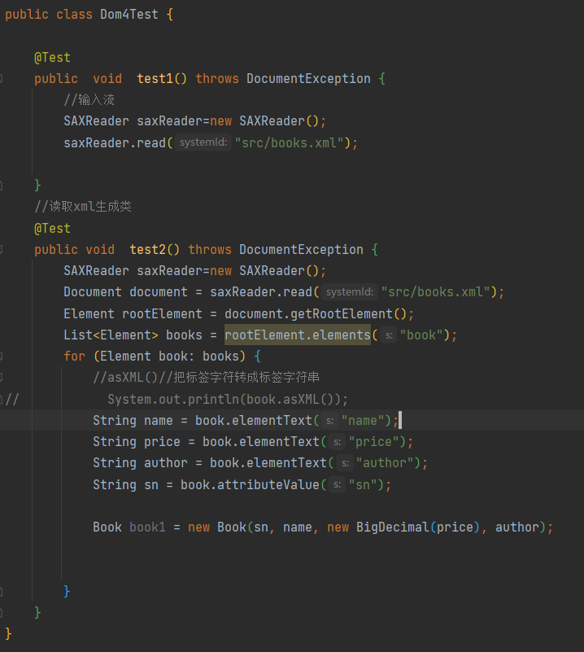
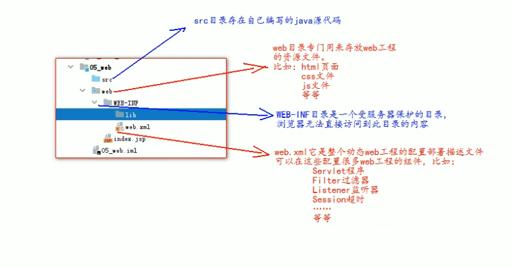

# JavaWeb

## XML

### 作用

1、用来保存数据，而且这些数据具有自我描述性 

2、它还可以做为项目或者模块的配置文件 

3、还可以做为网络传输数据的格式（现在 JSON 为主）。

### 语法

1. 文档声明。 
2.  元素（标签） 
3.  xml 属性 
4. xml 注释 
5. 文本区域（CDATA 区）

### XML例子

```xml
<?xml version="1.0" encoding="UTF-8"?>
<!-- xml 声明 version 是版本的意思 encoding 是编码 -->
<books> <!-- 这是 xml 注释 -->
<book id="SN123123413241"> <!-- book 标签描述一本图书 id 属性描述的是图书的编号--><name>java 编程思想</name> <!-- name 标签描述 的是图书 的信息 -->
<author>华仔</author> <!-- author 单词是作者的意思 ，描述图书作者-->
<price>9.9</price> <!-- price 单词是价格，描述的是图书 的价格-->
</book>
<book id="SN12341235123"> <!-- book 标签描述一本图书 id 属性描述 的是图书的编号--><name>葵花宝典</name> <!-- name 标签描述 的是图书 的信息 -->
<author>班长</author> <!-- author 单词是作者的意思 ，描述图书作者-->
<price>5.5</price><!-- price 单词是价格，描述的是图书 的价格 -->
</book>
</books>
```


### java调用



---

## TomCat

### 工程目录



---

## Servlet

### 介绍

​         Servlet 是运行在服务器上的一个 java 小程序，它可以接收客户端发送过来的请求，并响应数据给客户端。

### 配置web.xml

```xml
	<?xml version="1.0" encoding="UTF-8"?>
<web-app xmlns="http://xmlns.jcp.org/xml/ns/javaee"
         xmlns:xsi="http://www.w3.org/2001/XMLSchema-instance"
         xsi:schemaLocation="http://xmlns.jcp.org/xml/ns/javaee
http://xmlns.jcp.org/xml/ns/javaee/web-app_4_0.xsd"
         version="4.0">
    <!-- servlet 标签给 Tomcat 配置 Servlet 程序 -->
    <servlet>
        <!--servlet-name 标签 Servlet 程序起一个别名（一般是类名） -->
        <servlet-name>Hello</servlet-name>
        <!--servlet-class 是 Servlet 程序的全类名-->
        <servlet-class>com.atguigu.Servlet.Hello</servlet-class>
    </servlet>
    <!--servlet-mapping 标签给 servlet 程序配置访问地址-->
    <servlet-mapping>
        <!--servlet-name 标签的作用是告诉服务器，我当前配置的地址给哪个 Servlet 程序使用-->
        <servlet-name>Hello</servlet-name>
        <!--url-pattern 标签配置访问地址 <br/>
        / 斜杠在服务器解析的时候，表示地址为：http://ip:port/工程路径<br/>/hello 表示地址为：http://ip:port/工程路径/hello <br/>
        -->
        <url-pattern>/hello</url-pattern>
    </servlet-mapping>
</web-app>
```

### Servlet 生命周期


### 通过继承HttpServlet 实现 Servlet 程序


### IDEA 生成Servlet程序


### Servlet 接口结构


###  ServletConfig

[^程序的配置信息类]: 

三大作用:

1. 可以获取Servlet程序别名Servlet-name的值
2.  获取初始化参数 init-param
3.  获取ServletContent 对象

### ServletConfig

[^表示上下文对象]: 

是一个域对象 ，像Map一样的存取数据的对象

​                    存数据

Map               put

域对象        setAttribute

四大作用

1. 获取web.xml中配置的上下文参数
2.  获取工程路径
3.  获取工程部署后在服务器的绝对路径
4.  像Map一样存取数据

### http

#### GET

1. 请求行

   (1) 请求的方式 GET

   (2) 请求的资源路径

   (3)协议版本号

2.  请求头

     键值对

#### post

1. 请求行

   (1) 请求的方式 GET

   (2) 请求的资源路径

   (3)协议版本号

2.  请求头

     键值对
3，  请求体


### 请求类型


### MIME类型


### HttpServletRequest 类

#### 作用

```js
每次只要有请求进入 Tomcat 服务器，
Tomcat 服务器就会把请求过来的 HTTP 协议信息解析好封装到Request 对象中。
然后传递到 service 方法（doGet 和 doPost）中给我们使用。
我们可以通过 HttpServletRequest 对象，获取到所有请求的信息。 
```

#### 常用方法

```css
1. getRequestURI() 获取请求的资源路径
2. getRequestURL() 获取请求的统一资源定位符（绝对路径）
3. getRemoteHost() 获取客户端的 ip 地址
4. getHeader() 获取请求头
5. getParameter() 获取请求的参数
6. getParameterValues() 获取请求的参数（多个值的时候使用）
7. getMethod() 获取请求的方式 GET 或 POST
8. setAttribute(key, value); 设置域数据
9. getAttribute(key); 获取域数据
10. getRequestDispatcher() 获取请求转发对象
```

实例代码

```java
public class RequestAPIServlet extends HttpServlet {
@Override
protected void doGet(HttpServletRequest req, HttpServletResponse resp) throws ServletException,IOException {
// i.getRequestURI() 获取请求的资源路径
System.out.println("URI => " + req.getRequestURI());
// ii.getRequestURL() 获取请求的统一资源定位符（绝对路径）System.out.println("URL => " + req.getRequestURL());
// iii.getRemoteHost() 获取客户端的 ip 地址
/**
* 在 IDEA 中，使用 localhost 访问时，得到的客户端 ip 地址是 ===>>> 127.0.0.1<br/>* 在 IDEA 中，使用 127.0.0.1 访问时，得到的客户端 ip 地址是 ===>>> 127.0.0.1<br/>* 在 IDEA 中，使用 真实 ip 访问时，得到的客户端 ip 地址是 ===>>> 真实的客户端ip 地址<br/>*/
System.out.println("客户端 ip 地址 => " + req.getRemoteHost());
// iv.getHeader() 获取请求头
System.out.println("请求头 User-Agent ==>> " + req.getHeader("User-Agent"));// vii.getMethod() 获取请求的方式 GET 或 POST
System.out.println( "请求的方式 ==>> " + req.getMethod() );
}
}

```

#### 请求转发


#### base标签

见程序

### HttpServletResponse类


#### 输出流


#### 请求重定向


**sendRedirect**

## JavaEE 三层架构

Bean是一种规范，具体要满足一下几点。 
1、所有属性为private 
2、提供默认构造方法 
3、提供getter和setter 
4、实现serializable接口


> **开发流程**
>
> 1. 创建数据库  **(mysql)**	
>
> 2. 编写数据库对应的JavaBean 对象 **(bean包创建User类)**
>
> 3. 编写Utils类  创建数据库连接池  获取connection对象**(Utils包创建JDBCUtils)**
>
> 4. 编写BaseDAO 来执行sql语句  实现增删改查**(dao包下的impl包 创建 BaseDao**)
>
> 5. 编写 UserDAO 与 测试{
>
>     UserDAO接口--根据业务需求   
>
>     UserDAOImpl--继承BaseDao与UserDAO接口 用来写具体sql语句
>
>     }
>
> 6. 编写UserService 和 测试 {
>
>     UserService接口--根据业务需求   
>
>     UserServiceImpl- 用来解决WEB层发来的请求
>
>     }
>

> 注册功能的实现
>
> 

---

## JSP

jsp的作用是代替servlet 程序回传html页面的数据

### page 指令

### 脚本

```java
<%!		%>//声明脚本 声明变量
<%=		%>//表达式脚本 在jsp上输出数据 ||EL替代
<% java语句 %>//代码脚本 循环控制语句   ||JSTL 替代
```

### 注释

###  内置对象

```jsp
requst <请求对象>
response<响应对象>
pageContext<jsp的上下文对象>
session<会话对象>
application<ServletContext对象>
config<ServletConfig对象>
out<jsp输出流对象>
page<指向当前jsp的对象>
```

### 四大域对象


### out 与 response.write();

```jsp
out.write();
response.write();
```


### JSP标签

#### 静态包含

一格单独的jsp页面只维护一份，改一出，其他都统一

```css
<%@ include file="/include/footer.jsp"%>
1. 静态包含不会翻译被包含的jsp页面 
2. 静态包含其实是把被包含的jsp页面的代码拷贝到包含的位置执行输出
```

#### 动态包含

```css
<jsp:include page="/include/footer.jsp">
    <jsp:param name="username" value="bbj"/>
    <jsp:param name="password" value="root"/>
</jsp:include>

1. page 属性是指定你要包含的jsp页面的路径
2. 动态包含也可以像静态包含一样。把被包含的内容执行输出到包含位置

动态包含的特点：
        1、动态包含会把包含的jsp页面也翻译成为java代码
        2、动态包含底层代码使用如下代码去调用被包含的              jsp页面执行输出。
JspRuntimeLibrary.include(request, response, "/include/footer.jsp", out, false);
        3、动态包含，还可以传递参数
```


#### 转发标签

```css
<jsp:forward page=""></jsp:forward>
是请求转发标签，它的功能就是请求转发
page 属性设置请求转发的路径
```

### Listener监听器

```apl
javaWeb三大组件
1. Servlet  程序
2. Filter   过滤器
3. Listener 监听器

作用:
监听事物的变化，通过回调函数，反馈给客户去做处理
```

#### ServletContextListener

```css
作用
ServletContextListener可以监听ServletContext对象的创建和销毁
ServletContextListener在web工程启动时创建,在web工程停止的时候销毁

contextInitialized 创建
contexteDestroyed  销毁
```


---

## EL表达式

### 作用

```elixir
EL表达式主要是代替jsp页面中的表达式脚本在jsp页面中进行数据的输出

el 表达式zai输出数据时比jsp好
```

### 输出

```elixir
request.setAttribute("key","zhi");
EL表达式:${key}
//空串
```

### EL表达式搜索域数据的循序

```elixir
//1.
    pageContext.setAttribute("key", "pageContext");
//2.
    request.setAttribute("key", "requestt");
//3.
    session.setAttribute("key", "session");
//4.        
    application.setAttribute("key", "application");
    
<!--先输出域范围小的-->
```

### EL表达式输出Bean的属性

```css
输出name属性:${person.name}<br>
name来自person类的getPerson();
```

### EL运算

```css
1. empty 运算
{  可以判断数据是否为空
   null
   ""
   数组，集合等长度为零
}
2. 三元运算
3. .点运算
{
   可以输出Bean对象中的属性值
}
4. []运算 
{
   可以输出有序集合中某个元素的值   
}
```

### 11个隐含对象

EL自定义的变量


---

## JSTL 标签库

需要导入JSTL的jar包

### core核心库

1. < c:set > 可以在域中保存数据

   

2.  < c:if > if判断


3. < c:choose >< c:when >< c:otherwise > 

   作用：多路判断 跟swith case default一样


4. < c:forEach >  遍历循环


----

## 文件上传与下载

 [09_尚硅谷_文件的上传和下载_王振国 - 课堂笔记.pdf](..\..\资料\09-EL表达式&JSTL标签库\笔记\文件上传和下载\09_尚硅谷_文件的上传和下载_王振国 - 课堂笔记.pdf) 

### 浏览器判断

----

## 书城第三阶段--jsp

  [10_尚硅谷_书城项目-第三阶段代码优化_王振国 - 课堂笔记.pdf](..\..\资料\10-项目第三阶段\笔记\10_尚硅谷_书城项目-第三阶段代码优化_王振国 - 课堂笔记.pdf) 

---

## 第五阶段 --MVC--

1. 编写数据库
2. 编写图书模块的JavaBean
3. 编写图书模块的DAO与测试类


分页功能


添加

删除

---

## Cookie

### 作用

```js
1、Cookie 翻译过来是饼干的意思。
2、Cookie 是服务器通知客户端保存键值对的一种技术。
3、客户端有了 Cookie 后，每次请求都发送给服务器。
4、每个 Cookie 的大小不能超过 4kb
```

### 创建


```java
package com;

import jakarta.servlet.*;
import jakarta.servlet.http.*;

import java.io.IOException;

public class CookieServlet extends BaseServlet {

    protected void creatCookie(HttpServletRequest request, HttpServletResponse response) throws ServletException, IOException {
        //1. 创建Cookie对象
        Cookie cookie = new Cookie("key1", "value1");
        //2. 通过客户端保存Cookie
        response.addCookie(cookie);

        response.getWriter().write("Cookie创建成功");
    }

}

```


### 获取

req.getCookies();

```java
  protected void getCookie(HttpServletRequest request, HttpServletResponse response) throws ServletException, IOException {
        Cookie[] cookies = request.getCookies();

        for (Cookie cookie : cookies) {
            response.getWriter().write(cookie.getName()+"********"+cookie.getValue()+"\n");
        }
    }
```

### 修改

```java
 Cookie[] cookies = request.getCookies();
        Cookie cc=CookieUtils.findCookie("key1",cookies);
        cc.setValue("11");

        response.addCookie(cc);
        response.getWriter().write(cc.getValue());
```

### Cookie的生命控制

管理什么时候销毁

setMaxAge()；


### Path

Cookie 的 path 属性可以有效的过滤哪些 Cookie 可以发送给服务器。哪些不发。path 属性是通过请求的地址来进行有效的过滤。	

### 免密登陆


-----

## Session 会话

### 什么是 Session 会话?

1、Session 就一个接口（HttpSession）。

2、Session 就是会话。它是用来维护一个客户端和服务器之间关联的一种技术。

3、每个客户端都有自己的一个 Session 会话。 

4、Session 会话中，我们经常用来保存用户登录之后的信息

### 如何创建 Session 和获取(id 号,是否为新)

```javascript
如何创建和获取 Session。它们的 API 是一样的。
request.getSession()
第一次调用是：创建 Session 会话
之后调用都是：获取前面创建好的 Session 会话对象。

/*
isNew(); 判断到底是不是刚创建出来的（新的）
true 表示刚创建
false 表示获取之前创建
每个会话都有一个身份证号。也就是 ID 值。而且这个 ID 是唯一的。
getId() 得到 Session 的会话 id 值。
```

### 域数据的存储

```
setAttribute
getAttribute
```

### 生命周期

```css
public void setMaxInactiveInterval(int interval) 设置 Session 的超时时间（以秒为单位），超过指定的时长，Session就会被销毁。
值为正数的时候，设定 Session 的超时时长。
负数表示永不超时（极少使用）
public int getMaxInactiveInterval()获取 Session 的超时时间
public void invalidate() 让当前 Session 会话马上超时无效。
```

### 原理


---

## 验证码


---

## 购物车


## 订单模块


## Filter

### 介绍

1. Filter 过滤器它是 JavaWeb 的三大组件之一。三大组件分别是：Servlet 程序、Listener 监听器、Filter 过滤器
2. Filter 过滤器它是 JavaEE 的规范。也就是接口 
3. Filter 过滤器它的作用是：拦截请求，过滤响应。

拦截请求常见的应用场景有：

1. 权限检查
2. 日记操作
3. 事物管理
4.  .............dd

### FilterConfig

FilterConfig 类见名知义，它是 Filter 过滤器的配置文件类。 Tomcat 每次创建 Filter 的时候，也会同时创建一个 FilterConfig 类，这里包含了 Filter 配置文件的配置信息。FilterConfig 类的作用是获取 filter 过滤器的配置内容 

1、获取 Filter 的名称 filter-name 的内容 

2、获取在 Filter 中配置的 init-param 初始化参数 

3、获取 ServletContext 对象

### FilterChain


### 拦截路径

--精确匹配--   		/target.jsp

--目录匹配--  		/admin/*

--后缀名匹配--	  *.html

----

## ThreadLocal

使用 ThreadLocal 来确保所有 dao 操作都在同一个Connection连接对象中完成


## JSON

### 介绍

```css
JSON (JavaScript Object Notation) 是一种轻量级的数据交换格式。易于人阅读和编写。同时也易于机器解析和生成。JSON采用完全独立于语言的文本格式，而且很多语言都提供了对 json 的支持（包括 C, C++, C#, Java, JavaScript,Perl,Python等）。 这样就使得 JSON 成为理想的数据交换格式。

json是一种轻量级的数据交换格式。

轻量级指的是跟 xml 做比较。

数据交换指的是客户端和服务器之间业务数据的传递格式。
```

### JS的使用

json 是由键值对组成，并且由花括号（大括号）包围。每个键由引号引起来，键和值之间使用冒号进行分隔，多组键值对之间进行逗号进行分隔。

```json
//json 的定义
var jsonObj = {
"key1":12,
"key2":"abc",
"key3":true,
"key4":[11,"arr",false],
"key5":{
"key5_1" : 551,
"key5_2" : "key5_2_value"
},
"key6":[{
"key6_1_1":6611,
"key6_1_2":"key6_1_2_value"
},{
"key6_2_1":6621,
"key6_2_2":"key6_2_2_value"
}]
};
//json 的访问同 js
```

### javaBean 和 json 的互转

```java
package com.json;

import com.bean.Person;
import com.bean.PersonListType;
import com.google.gson.Gson;
import com.google.gson.reflect.TypeToken;
import org.junit.jupiter.api.Test;

import java.util.ArrayList;
import java.util.HashMap;
import java.util.List;
import java.util.Map;

public class Json {
    //javaBean 和 json 的互转
    @Test
    public void test1() {
        Person aa = new Person(1, "aa");
        Person bb = new Person(2, "bb");
        Gson gson = new Gson();
        //java对象转JSON
        String s = gson.toJson(aa);
        System.out.println(s);
        //JSON转Java
        Person person = gson.fromJson(s, Person.class);
        System.out.println(person);
    }

    //List 和 json 的互转
    @Test
    public void test2() {
        List<Person> personList = new ArrayList<>();
        personList.add(new Person(1, "国哥"));
        personList.add(new Person(2, "康师傅"));
        Gson gson = new Gson();
        // 把 List 转换为 json 字符串
        String personListJsonString = gson.toJson(personList);
        System.out.println(personListJsonString);
        //JSON转List
        List<Person> list = gson.fromJson(personListJsonString,new TypeToken<List<Person>>(){}.getType());
        System.out.println(list);
        Person person = list.get(0);
        System.out.println(person);


    }


    // 1.2.3、map 和 json 的互转
    @Test
    public void test3() {
        Map<Integer, Person> personMap = new HashMap<>();
        personMap.put(1, new Person(1, "国哥好帅"));
        personMap.put(2, new Person(2, "康师傅也好帅"));
        Gson gson = new Gson();
        // 把 map 集合转换成为 json 字符串
        String personMapJsonString = gson.toJson(personMap);
        System.out.println(personMapJsonString);

        //JSON转Map
        Map<Integer, Person> map = gson.fromJson(personMapJsonString,new TypeToken<HashMap<Integer,Person>>(){}.getType());

        System.out.println(map);
        Person p = map.get(1);
        System.out.println(p);
    }
}

```

----

## AJAX


```html
<!DOCTYPE html PUBLIC "-//W3C//DTD HTML 4.01 Transitional//EN" "http://www.w3.org/TR/html4/loose.dtd">
<html>
<head>
    <meta http-equiv="pragma" content="no-cache"/>
    <meta http-equiv="cache-control" content="no-cache"/>
    <meta http-equiv="Expires" content="0"/>
    <meta http-equiv="Content-Type" content="text/html; charset=UTF-8">
    <title>Insert title here</title>
    <script type="text/javascript">
        function ajaxRequest() {
// 				1、我们首先要创建XMLHttpRequest
            let xmlHttpRequest = new XMLHttpRequest();
// 				2、调用open方法设置请求参数
            xmlHttpRequest.open("GET", "http://localhost:8080/JSON/ajaxServlet?action=js", true);

// 				3、在send方法前绑定onreadystatechange事件，处理请求完成后的操作。
            xmlHttpRequest.onreadystatechange = function () {
                if (xmlHttpRequest.readyState === 4 && xmlHttpRequest.status === 200) {
					let obj = JSON.parse(xmlHttpRequest.responseText);
                    let div = document.querySelector("#div01");

					div.innerHTML=`编号${obj.id},姓名${obj.name}`;
                }
            }
// 				4、调用send方法发送请求
            xmlHttpRequest.send();
        }
    </script>
</head>
<body>
<button onclick="ajaxRequest()">ajax request</button>
<div id="div01">
</div>
</body>
</html>
```

### JQuery 中的 AJAX 请求


$.getJSON


```apl
$.serialize();
```


---

## i8n国际化


