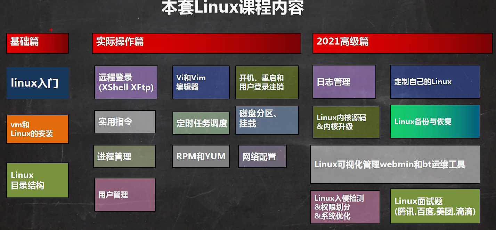
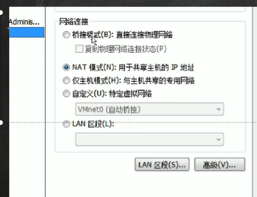
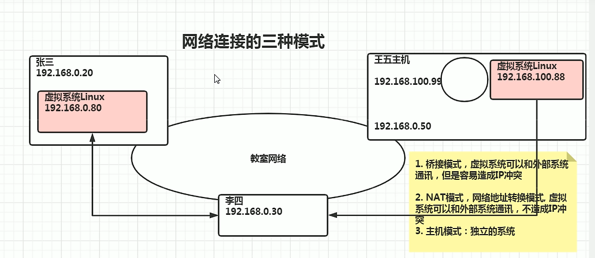
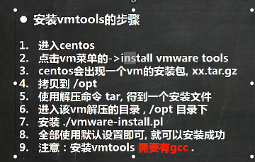
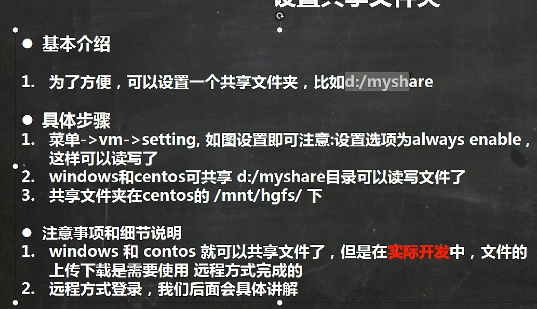
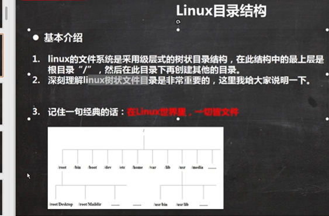
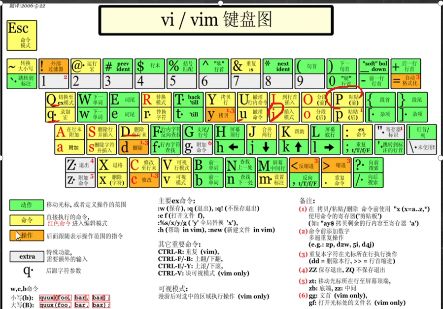
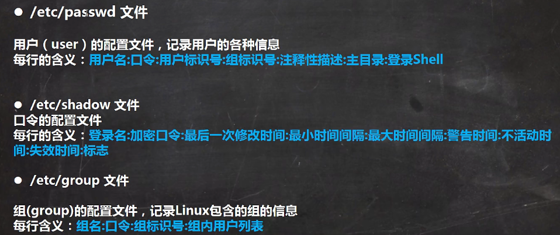

# 概述



# Linux指令大全

```properties
tat - zxvf xxxxxx.tar.gz :解压
useradd 用户名: 创建用户
userdel - r 用户名:删除用户
ifconfig:网络信息 类似ipconfig
```


---

# 基础篇

## VM和Linux的安装

> VM

官网下载VM pro15.5

激活码UY758-0RXEQ-M81WP-8ZM7Z-Y3HDA

> Linux Centos 8.1

[centos-8-isos-x86_64安装包下载_开源镜像站-阿里云 (aliyun.com)](https://mirrors.aliyun.com/centos/8/isos/x86_64/)



网络连接的三种方式

- 桥接模式：虚拟系统可以与外部系统通讯，但容易造成ip冲突
- NAT模式：网络地址转换模式，虚拟系统可以与外部系统通讯，但容易造成ip冲突
- 主机模式



----

## 虚拟机克隆


## 虚拟机快照

作用：存档回滚

---

## 虚拟机的迁移和删除


## VM tools

1. 可以让我们在windows下更好的管理vm虚拟机
2. 可以设置windows和centos的共享文件夹






## Linux目录结构



```properties
/root:主目录 

/boot:linux系统启动核心文件

/dev:设备管理器

/bin /usr/bin /usr/local/bin:经常使用的命令

**/sbin:系统管理员的系统管理程序

/home:存放普通用户的主目录，在linux中每个用户都有自己的目录，一般该目录以用户的账号命名

/root:系统管理员的主目录

/lib:系统开机所需要最基本的动态连接共享库，其作用类似于windows里的DLL文件，几乎所有的也会应用程序都需要用到这些共享库

/lost+found:当用户非法关机后，这里存放了一些文件

/etc:所有的系统管理所需要的配置文件和子目录 my.conf

/usr:用户的很多应用程序和文件都放在这个核心目录下，类似于windows下的program files目录

/proc:虚拟目录，系统内存的映射访问这个目录来获取系统信息
/srv:存放一些服务启动后需要提取的数据
/sys:这是linux2.6内核的一个很大的变化，该目录下安装了2.6内核新出现的一个文件系统sysfs

/temp:临时文件

/mnt:系统提供该目录就是为了让用户临时挂载别的文件系统的。我们可以将外部的存储挂载在/mnt/上,然后进入该目录就可以查看里面的内容了d:/myshare

/opt:这是给主机额外安装软件所摆放的目录。安装Oracle数据库就可放在该目录下，默认为空。

/media:Linux系统会自动识别一些设备，Linux会把识别的设备挂载到这个目录下。

/usr/local:这是另一个给主机额外安装软件所通过编译源码方式安装的程序。

/var:这个目录存放着不断扩充着的东西。习惯将经常被修改的目录放在这个目录下包括各种日志文件。

/selinux:是一种安全子系统，它能控制程序只能访问特定文件。有三种工作模式可以自行设置
```

## 远程登录

Xshell6

Xftp

 ## Vim

```properties
i:编辑模式
：wq:命令行模式 
wq:保存并退出

vim hello.java :编辑文件，没有自动创建

--正常模式
yy:拷贝
p:粘贴
dd:删除
u:撤销
G:定位到末行
gg:首行
12行shift g:光标定位到12行

--命令行模式
n:查找切换
set nu:显示行数
set nonu:不显示行数
```



## 开关机等

> 关机 重启

```properties
shutdown -h now: 立刻进行关机
shutdown -h 1  : 一分钟后关机了
shutdown -r now: 重新启动计算机
halt           : 关机
reboot          : 重新启动计算机
sync           : 把内存的数据同步到磁盘
```

> 登录与注销

```properties
logout: 注销
su - 用户名:切换用户
```

## 用户管理

```properties
useradd 用户名 : 创建用户
passwd  用户名 : 设置密码
pwd           : 当前用户的目录

userdel 用户名 : 删除用户
userdel -r tom: 删除用户以及home下的目录 
```

```properties
id 用户名: 查询用户信息指令
who am i: 查看当前用户
```

> 用户组
>
> ```properties
> groupadd 组名: 新增组
> 
> groupdel 组名: 删除组
> 
> useradd -g 用户组 用户名: 添加用户时加上组
> 
> usermod -g 用户组 用户名: 修改用户的组
> ```
>
> 



shell 编译器
