# 概述


# Linux指令大全

```properties
tat - zxvf xxxxxx.tar.gz : 解压

useradd 用户名: 创建用户

userdel - r 用户名: 删除用户

ifconfig: 网络信息 类似ipconfig

ls -l *sh: 查找文件名包含sh的文件 

locale -a |grep "zh_CN": 可以使用下面的命名查看系统是否安装了中文安装包

ls -a: 列出所有文件，包括.开头的隐藏文件

ls -l: 单列输出

ls -a -l [文件路径] : 组合

ls -l -h : 显示文件大小

ll -r: 递归显示

pwd: 当前用户的目录

cd ~: 回到用户的home目录

cal [选项]: 显示日期

ps -ef | grep adt: 显示进程

tree 目录: 树状显示目录结构

netstat -anp|more: 查看端口/协议

wc -l : 统计数量
xargs : 显示文件行数
```

---

# 安装篇

## VM和Linux的安装

> VM

官网下载VM pro17

激活码UY758-0RXEQ-M81WP-8ZM7Z-Y3HDA

> Linux Centos 8.1

[centos-8-isos-x86_64安装包下载_开源镜像站-阿里云 (aliyun.com)](https://mirrors.aliyun.com/centos/8/isos/x86_64/)


网络连接的三种方式

- 桥接模式：虚拟系统可以与外部系统通讯，但容易造成ip冲突
- NAT模式：网络地址转换模式，虚拟系统可以与外部系统通讯，但容易造成ip冲突
- 主机模式


----

## 虚拟机克隆


## 虚拟机快照

作用：存档回滚

---

## 虚拟机的迁移和删除


## VM tools

1. 可以让我们在windows下更好的管理vm虚拟机
2. 可以设置windows和centos的共享文件夹


# 基础篇

## Linux目录结构


```properties
/root:主目录 

/boot:linux系统启动核心文件

/dev:设备管理器

/bin /usr/bin /usr/local/bin:经常使用的命令

**/sbin:系统管理员的系统管理程序

/home:存放普通用户的主目录，在linux中每个用户都有自己的目录，一般该目录以用户的账号命名

/root:系统管理员的主目录

/lib:系统开机所需要最基本的动态连接共享库，其作用类似于windows里的DLL文件，几乎所有的也会应用程序都需要用到这些共享库

/lost+found:当用户非法关机后，这里存放了一些文件

/etc:所有的系统管理所需要的配置文件和子目录 my.conf

/usr:用户的很多应用程序和文件都放在这个核心目录下，类似于windows下的program files目录

/proc:虚拟目录，系统内存的映射访问这个目录来获取系统信息
/srv:存放一些服务启动后需要提取的数据
/sys:这是linux2.6内核的一个很大的变化，该目录下安装了2.6内核新出现的一个文件系统sysfs

/temp:临时文件

/mnt:系统提供该目录就是为了让用户临时挂载别的文件系统的。我们可以将外部的存储挂载在/mnt/上,然后进入该目录就可以查看里面的内容了d:/myshare

/opt:这是给主机额外安装软件所摆放的目录。安装Oracle数据库就可放在该目录下，默认为空。

/media:Linux系统会自动识别一些设备，Linux会把识别的设备挂载到这个目录下。

/usr/local:这是另一个给主机额外安装软件所通过编译源码方式安装的程序。

/var:这个目录存放着不断扩充着的东西。习惯将经常被修改的目录放在这个目录下包括各种日志文件。

/selinux:是一种安全子系统，它能控制程序只能访问特定文件。有三种工作模式可以自行设置
```

## 远程登录

Xshell6

Xftp

 ## Vim

```properties
i:编辑模式
：wq:命令行模式 
wq:保存并退出

vim hello.java :编辑文件，没有自动创建

--正常模式
yy:拷贝
p:粘贴
dd:删除
u:撤销
G:定位到末行
gg:首行
12行shift g:光标定位到12行

--命令行模式
n:查找切换
set nu:显示行数
set nonu:不显示行数
```


## 开关机等

> 关机 重启

```properties
shutdown -h now: 立刻进行关机
shutdown -h 1  : 一分钟后关机了
shutdown -r now: 重新启动计算机
halt           : 关机
reboot          : 重新启动计算机
sync           : 把内存的数据同步到磁盘
```

> 登录与注销

```properties
logout: 注销
su - 用户名:切换用户
```

## 用户管理

```properties
useradd 用户名 : 创建用户
passwd  用户名 : 设置密码

userdel 用户名 : 删除用户
userdel -r tom: 删除用户以及home下的目录 
```

```properties
id 用户名: 查询用户信息指令
who am i: 查看当前用户
```

> 用户组
>
> ```properties
> groupadd 组名: 新增组
> 
> groupdel 组名: 删除组
> 
> useradd -g 用户组 用户名: 添加用户时加上组
> 
> usermod -g 用户组 用户名: 修改用户的组
> ```
>
> 


shell 编译器，解释器


> 找回密码

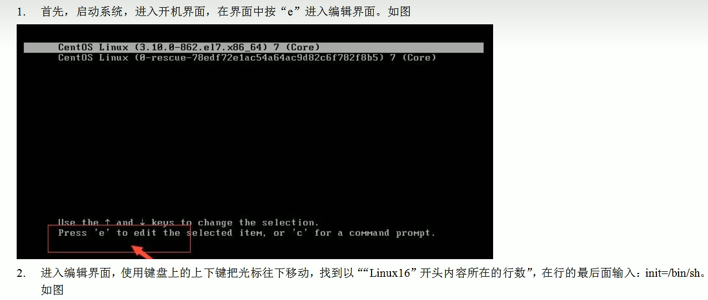


---

## 运行级别

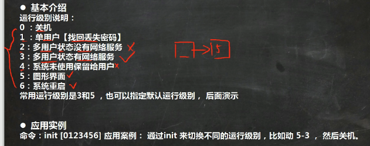

```properties
init [0,1,2,3,4,5,6]         : 切换运行级别
systemctl get-default        : 查看当前运行级别
systemctl set-default multi-user.target: 设置默认运行级别为3

multi-user.target            : 运行级别3
graphical.target             : 运行级别5
```

## 帮助指令

```properties
man [命令或配置文件]: 获得帮助信息
help 命令: 获取shell内置命令的帮助信息

```

## 目录指令

```properties
cd
cd ../
cd ~
cd /home/lpl

mkdir  [-p(多级目录)] [目录名]: 创建目录

rmdir [目录名]: 删除空目录
rm -rf [目录名]: 删除非空目录

touch [文件名]: 创建空文件

cp [-r 递归复制] source dest: 拷贝文件

rm [-r 递归删除][-f 删除不提示]: 移除

mv cat.txt pig.txt: 重命名
mv /home/pig.txt  /root/:移动 

cat [文件] [-n 显示行号]: 查看文件
cat hello.java | more: 把文件交给more处理

more

less

echo [选项][输出内容]: 输出内容到控制台||输出环境变量
echo $HOSTNAME

head -n 5 文件: 查看文件开头5行内容
tail -n 5 -f(跟踪文件的更新): 查看文件结尾5行内容

ls -l > 文件:将列表内容写到a.txt中 覆盖写
>>:追加到末尾

ln -s [原文件][软连接名]:创建快捷方式

history: 历史命令

```


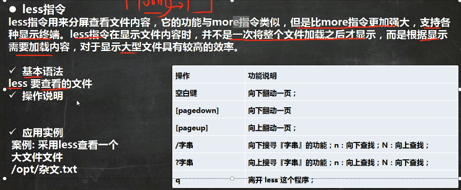

---

## 时间日期

```properties
date : 显示当前时间
date + %Y : 显示当前年份
date + %m : 显示当前月份
date + %d : 显示当前天
date "+%Y-%m-%d %H：%M：%S": 显示当前年份

date -s 字符串时间 : 设置日期
```

---

## 搜索查找

```properties
find [搜索范围][-name -user -size] : 向下遍历查找
find / -name *.txt
find / -size +(大于) 200M
-小于
等于
K,M,G
--------------------------------------------------
locate 文件名: 快速定位文件路径，依赖数据库索引
--------------------------------------------------
which : 指令的目录
--------------------------------------------------
grep -i main hello.java: 过滤查找
-i: 忽略字幕大小写
-n: 显示匹配行，行号
-r: 递归查找文件，包括文件里的
cat hello.java | grep main 
```

## 压缩和解压

> 压缩

```properties
gzip /home/hello.txt : 压缩
zip [-r] xxx.zip 要压缩的内容
```

> 解压

```properties
gunzip /home/hello.txt.gz : 解压
unzip [-d 解压后目录] xxx.zip
```

> tar

```properties
tar [选项] XXX.tar.gz 打包的内容: .tar.gz

-c : 产生.tar打包文件
-v : 显示详细信息
-f : 指定压缩户后的文件名
-z : 打包同时压缩
-x : 解压.tar文件

tar -zcvf pc.tar.gz /home/pig.txt /home/cat.txt

tar -zxvf pc.tar.gz -C /opt/tmp2

压缩:tar -zcvf 压缩包名.tar.gz 要打包的文件1 文件2...
解压:tar -zxvf 要解压的压缩包路径 解压路径
```

## 组管理与权限管理

> 组管理

linux中每个用户必须属于一个组。

linux每个文件有`所有者` `所在组` `其他组` 

```properties
ls -ahl: 查看文件的所有者
chown 用户名 文件名:修改文件所有者 
```

```properties
groupadd 组名: 新增组
groupdel 组名: 删除组
useradd -g 用户组 用户名: 添加用户时加上组
usermod -g 用户组 用户名: 修改用户的组
usermod -d 目录名 用户名: 改变用户登录的初始目录

chgrp 组名 文件名: 修改文件的所在组
```

> 权限管理

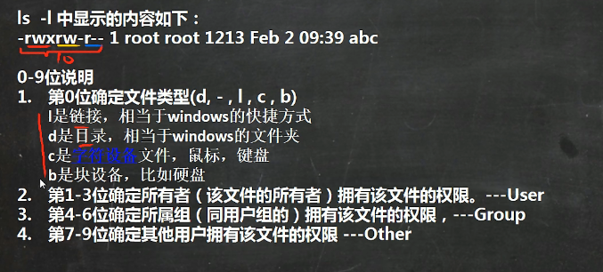


```properties
#修改权限
#u:所有者	g:所有组	o:其他人	a:所有人
chmod u=rwx，g=rx，0=x
chmod o+w
chmod a-x

1)给abc文件的所有者除去执行的权限，增加组 写的权限
chomd u-x,g+w abc


#修改文件所有者
chown tom abc.txt

将/home/test目录下所有文件和目录的所有者而改成tom
chowm -R tom /home/test

#修改文件所在组
将/home/test目录下所有文件和目录的所在组而改成shaolin: chowm -R shaolin /home/test

#
文件的修改取决于文件是否有w权限，文件的删除取决于所属目录是否有w权限。谨记
```

## 定时任务

> crond任务调度


```properties
crontab -e: 编辑定时任务
crontab -l: 查询crontab任务
crontab -r: 删除当前用户所有的crontab任务

多条任务可先写到.sh文件里，给执行权限

```

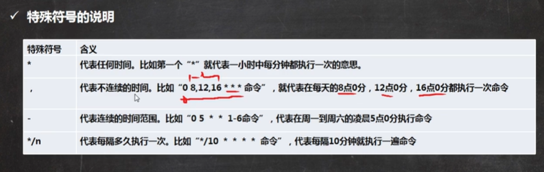

> at 一次性定时计划任务

每隔60秒，执行任务队列里的任务，任务只执行一次

```properties
at [选项][时间]
at 5pm +2days
> /bin/ls /home
ctrl+d: 输入结束

atq: 查看系统中没有执行的任务

atrm: 删除已经设置的任务

at now +2minutes
```

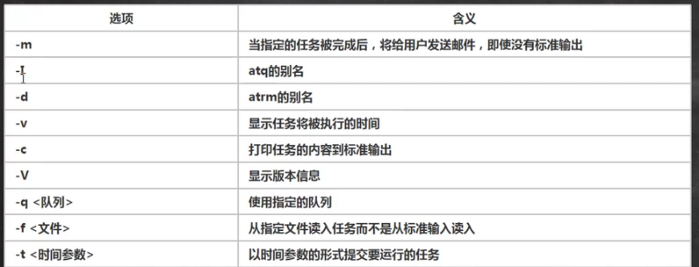


## 磁盘分区

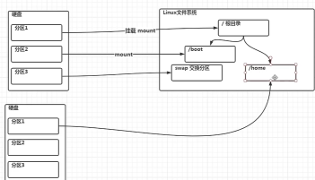

```properties
lsblk: 查看所有设备挂在情况
```

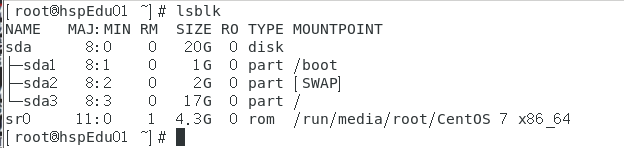

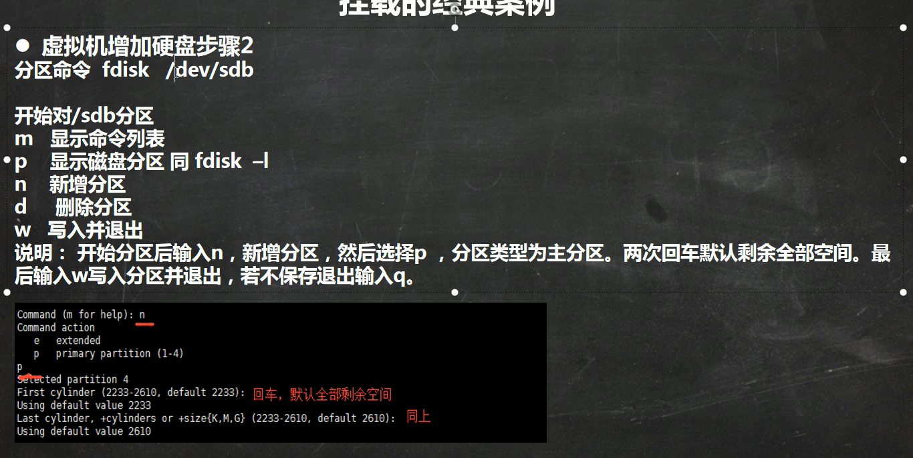

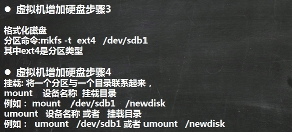

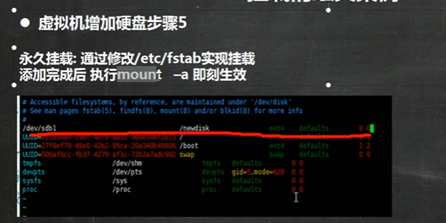

```properties
df -h: 磁盘情况查询
du [选项]  目录: 查询指定目录的磁盘使用情况

-s 汇总
-a 含文件
-h 带计量单位
-max-depth=1:子目录深度
-c: 列出明细的同时，增加汇总值

ls -l/opt |grep "^-" |wc -l
```

## 网络配置

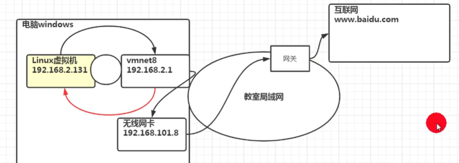

NAT模式

```properties
#指定ip
#vim /etc/sysconfig/network-scripts/ifcfg-ens33
```

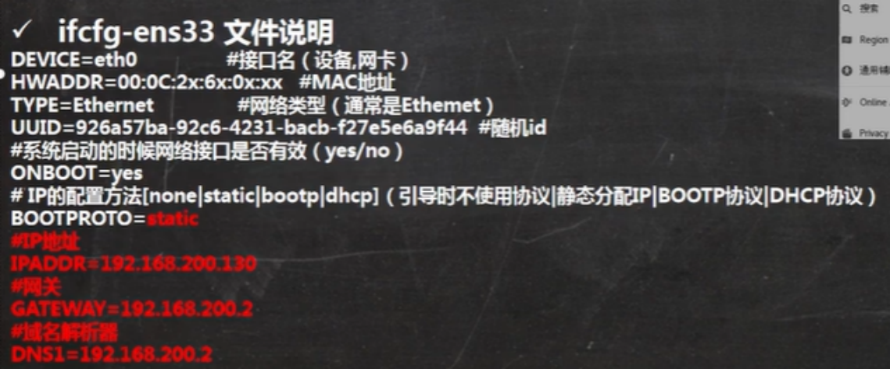

> 设置主机名

hostname : 查看主机名

vim /etc/hostname : 修改主机名

重启生效

> hosts映射 
>
> 通过主机名访问ip

`windows`

C:\Windows\System32\drivers\etc\hosts

`linux`

/etc/hosts

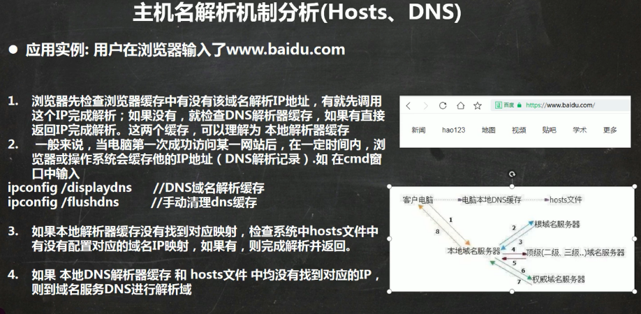

## 进程管理


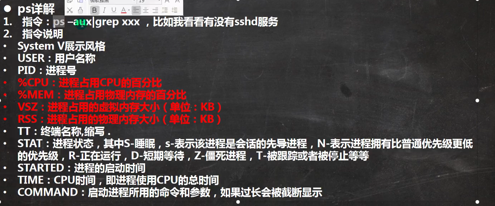

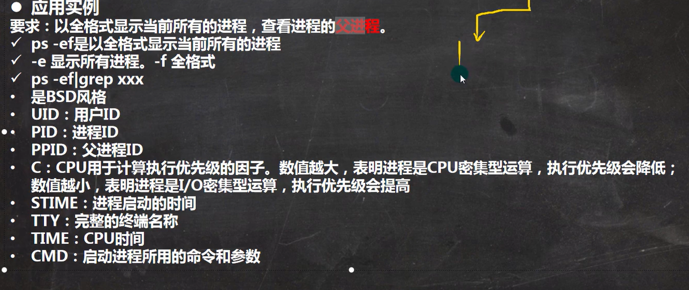


直接 systemctl start sshd 也行

```properties
pstree: 查看进程树

-p: 显示进程的PID
-u: 显示进程的所属用户
```

## 服务管理

```properties
systemctl 服务名 []: 服务管理centos7.0之后，之前用service
[]: start | stop | restart | reload | status

setup: 自启动管理

chkconfig: 给服务设置运行级别
chkconfig 服务名 --list: 查看服务
chkconfig --level 5 服务名 on/off: 设置运行级别
reboot生效


```

### 开机流程


```properties
systemctl管理的服务在: /usr/lib/systemd/system 

#systemctl 设置服务的自启动状态，同时设置3和5运行级别的自启动
systemctl list-unit-files : 查看服务开机启动状态
systemctl enable 服务名    : 设置服务开机启动
systemctl disable 服务名   : 关闭服务器开机启动
systemctl is-enabled 服务名: 查询某个服务是否自启动的
systemctl status 服务名    : 查看服务的状态
```

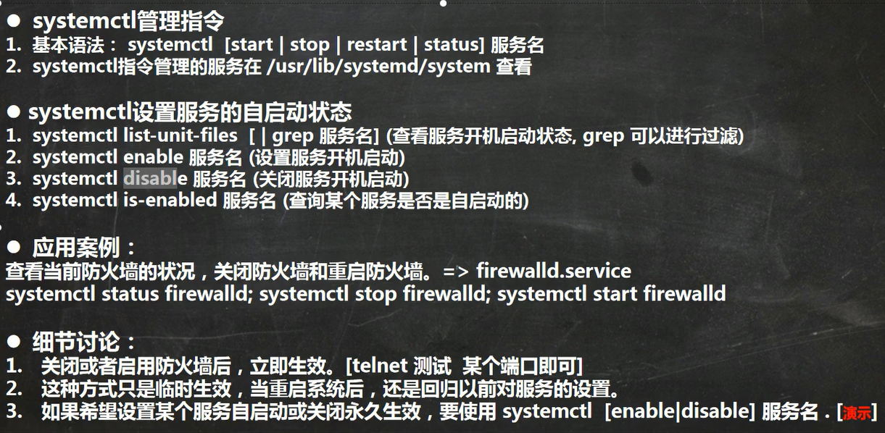

### 防火墙

```properties
#打开或关闭防火墙指定端口
 
firewall-cmd --permanent --add-port=端口号/协议 : 打开端口
firewall-cmd --permanent --remove-port=端口号/协议 : 关闭端口
firewall-cmd --reload: 重新载入，才能生效
firewall-cmd --query-port=端口/协议 : 查询端口是否开放
firewall-cmd --list-ports: 查看已经放开的端口
```

---

## 动态监控

```properties
#top与ps不同，top在执行一段时间可以更新正在运行的进程
top [选项]
-d 秒速: 指定top命令每隔几秒更新，默认是3秒
-i    : 使top不显示任何闲置或者僵死进程
-p    : 通过指定进程的id来监控状态

#交互操作
P: 以cpu使用率排序
M: 以内存使用率排序
N: 以pid排序
q: 退出top
u: 监视特定用户
k: kill进程
```

### 监控网络状态

```properties
netstat [选项]: 查看系统网络情况
-an : 按一定顺序排列输出
-p  : 显示哪个进程在调用

```

# 开发环境搭建

## rpm

> rpm用于互联网的下载包的打包或安装 的工具
>
> 类似于windows的setup.exe

```properties
rpm -qa               :查询已安装的rpm列表
rpm -qi firefox       :查询软件包信息
rpm -ql firefox       :查询软件包中的文件
rpm -qf /etc/passwd   :查询文件所属的软件包

rpm -e 软件包名称       :删除软件包

rpm -ivh rpm包全路径名称:安装rpm包
i :install安装
v :verbose提示
h :hash进度条
```

---

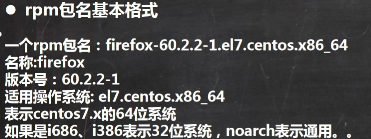

## yum

>`yum`是一个Shell前端软件包管理，基于rpm包管理，能够从指定的服务器自动下载rpm包并且安装，可以自动处理依赖习惯性关系，并且一次安装所有依赖的软件包

```properties
yum list |grep xxx: 查询yum服务器是否有需要安装的软件
yum install xxx: 下载安装
```


## 安装环境

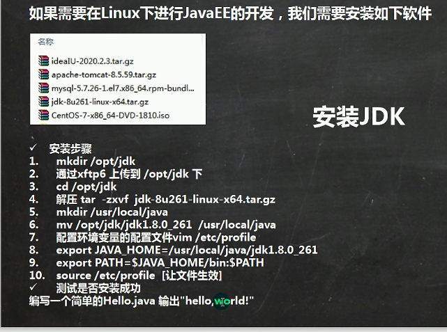

 没javac变量配置无误后运行yum install java-1.8.0-openjdk-devel

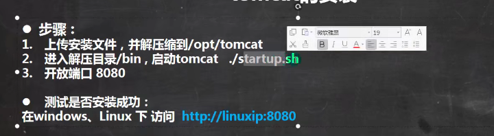

> mysql
>
> [(24条消息) Linux yum安装MySQL 8.0_Kathyao的博客-CSDN博客](https://blog.csdn.net/yjj_xss/article/details/104931808)
>
> 远程登录
>
> [(24条消息) mysql ERROR 1130 问题解决方案_mysql错误号码1130_推敲的博客-CSDN博客](https://blog.csdn.net/jrn1012/article/details/53231244)
>
> [(24条消息) mysql远程连接错误：2059 、2003_風の住む街~的博客-CSDN博客](https://blog.csdn.net/weixin_38924500/article/details/105436590#:~:text=Navicat连接云服务器上的 mysql 数据库出现 2059 的 错误 代码提示 远程连接,mysql -uroot -p 2、更改访问 mysql 服务器的用户权限 alter user)
>
> 

# Shell

> Shell 是一个命令行解释器。它为用户提供了一个向linux内核发送请求以便运行程序的界面系统级程序，用户可以用shell来启动，挂起，停止甚至编写程序

1. 以`#!/bin/bash`开头

2. 需要有可执行权限

   `用sh命令`不需要 sh hello.sh

## 变量

```properties
#系统变量
$HOME
#自定义变量
a=1 
echo $a
#显示所有变量
set
#静态变量
readonly b=2;

#规范
变量大写

#赋值
A=`echo 11`;
A=$(echo 11);
```

## 设置环境变量

```properties
export 变量名=变量值 
source 配置文件: 让修改生效
```

## 位置参数变量


## 预定义变量

```properties
#shell设计者事先定义好的变量
$$:显示当前进程的PID
$!:后台运行的最后一个进程的PID
$?:最后一次执行的命令的返回状态，0表示上一个命令正确执行;非0（可自己指定），则上一个命令执行不正确
```

## 运算符

```properties
expr m + n 
$[]
\* :乘
/  :除
%  :取余
```

##  条件判断

```properties
[ condition ]
非空返回true
```


```shell
#
if [ "ok"="ok" ]
then
         echo "1"
fi
#
if   [ 条件 ] then 
	  .....
elif [ 条件 ]then
      .....
fi
```

## 流程控制

```shell
case $1 in
"1")
    echo 1
;;
"2")
    echo2
;;
*)
	echo null
;;
esac
```

```shell
for i in "$@"
do
	echo $i 
done


SUM=0;
for(( i=1; i<10; i++))
do
	SUM=$[$SUM+$i]
done
```

```properties
i=1
SUM=0
while [ $i -le $1 ]
do
  SUM=$[$SUM+$i]
  i=$[$i+1]
done

echo $SUM
```

## read读取控制台输入

```properties
read [选项][参数] 
-p:指定读取值时的提示符
-t:指定读取值时等待的时间（秒）

#!/bin/bash
read -t 3 -p “输入” a
echo $a
```

## 函数

> 系统函数

```properties
basename ../shellCode/read.sh 
read.sh:结果

basename ../shellCode/read.sh .sh 
read:结果

dirname ../shellCode/read.sh 
../shellCode:结果
```

> 自定义函数

```shell
#!/bin/bash
function getSum(){
        SUM=$[$n1+$n2]
        echo $SUM
}
read -p "n1=" n1
read -p "n2=" n2

getSum 
```

## 定时备份数据库


```shell
#备份目录
BACKUP=/data/backup/db
#当前时间
DATETIME=$(date +%Y-%m-%d_%H%M%S)
echo $DATETIME
#数据库的地址
HOST=localhost
#数据库用户名
DB_USER=root
#数据库密码
DB_PW=hspedu100
#备份的数据库名
DATABASE=hspedu
#创建备份目录, 如果不存在，就创建
[ ! -d "${BACKUP}/${DATETIME}" ] && mkdir -p "${BACKUP}/${DATETIME}"
韩顺平 2021 图解 Linux 全面升级
更多学习资料 ，学习路线 ， 职业规划 关注微信公众号 hspcode 第 114页
#备份数据库
mysqldump -u${DB_USER} -p${DB_PW} --host=${HOST} -q -R --databases ${DATABASE} | gzip >
${BACKUP}/${DATETIME}/$DATETIME.sql.gz
#将文件处理成 tar.gz
cd ${BACKUP}
tar -zcvf $DATETIME.tar.gz ${DATETIME}
#删除对应的备份目录
rm -rf ${BACKUP}/${DATETIME}
#删除 10 天前的备份文件
find ${BACKUP} -atime +10 -name "*.tar.gz" -exec rm -rf {} \;
echo "备份数据库${DATABASE} 成功~"


-exec继续执行   命令  ｛｝前面指令得到的内容   \；结尾符号
不直接用tar, 是因为tar好像没法接收管道 '|' 传的数据, 而且还必须cd 到目录
```

---

# 日志

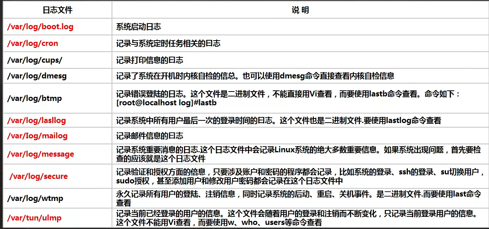

## 日志管理服务rsyslogd

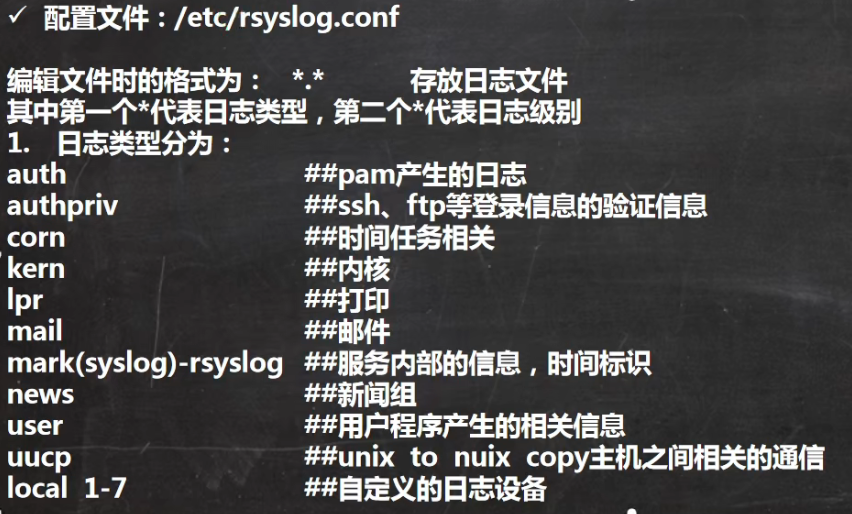


## 日志信息

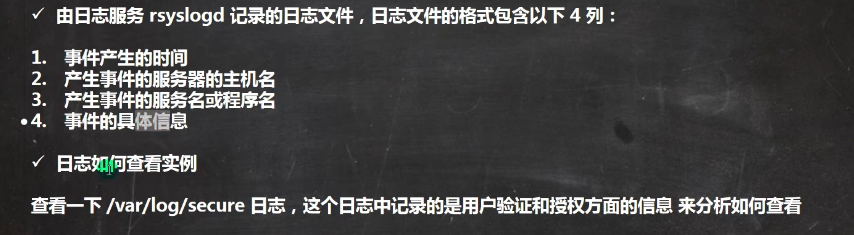

```yaml
Apr 20 09:31:45 myhostname gdm-password]: gkr-pam: unlocked login keyring
```

## 自定义日志

```yaml
vim rsyslog.conf
*.*  /var/log/hsp.log
```

## 日志轮替

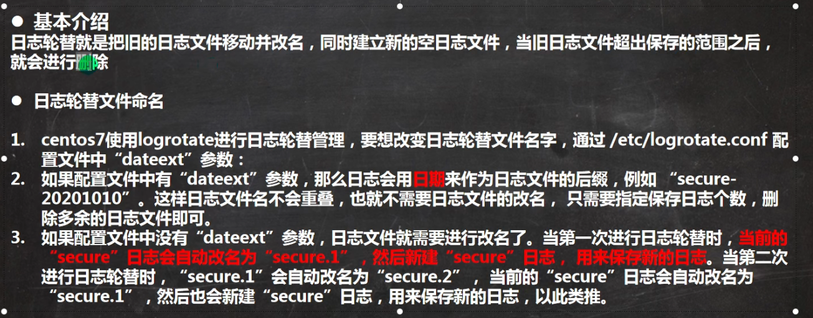

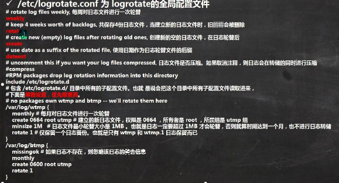


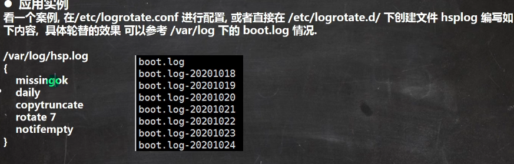

## 内存日志


---

# 定制linux

## linux启动流程

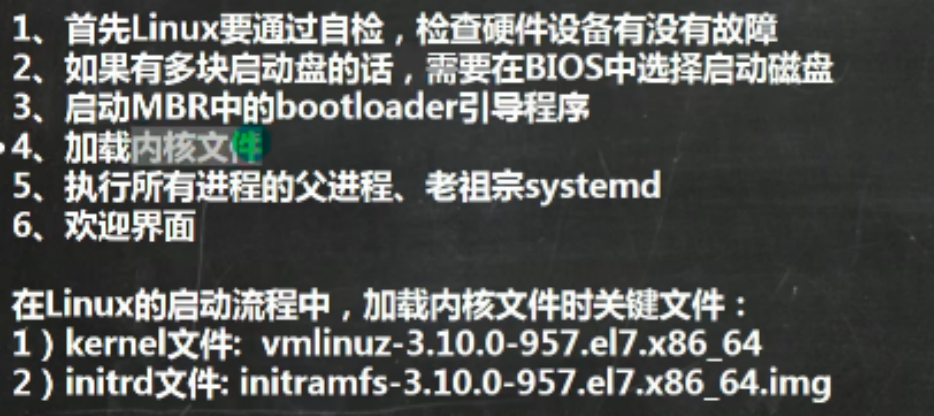

## 制作

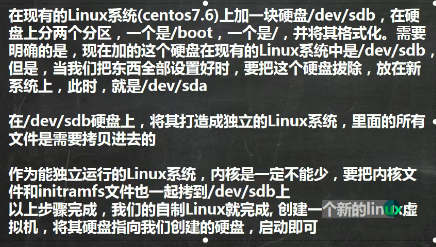

---

# 备份与恢复

```properties
yum -y install dump
yum -y install restore
```

## 备份

> dump 支持分卷和增量备份

```properties
dump [-cu] [123456789] [-f <备份后文件名>] [-T <日期>] [目录或文件系统]
```

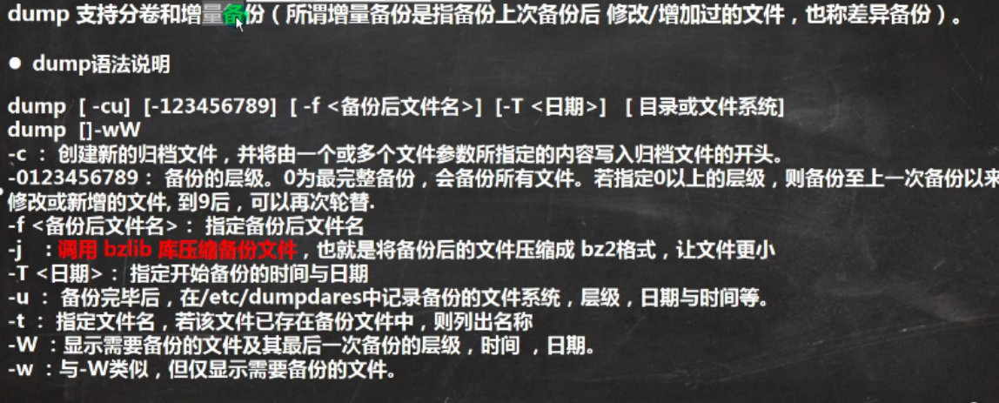

```shell
# 将/boot 目录所有内容备份到 /opt/boot.bak.bz2 文件中，备份层级为0
dump -0uj -f /opt/book.bak.bz2 /boot
```

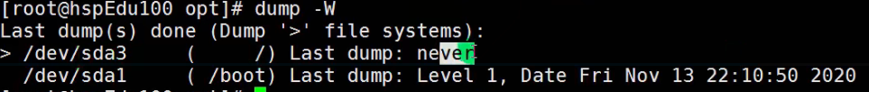

> 只有分区支持`增量备份`

## 恢复

```shell
restore -C -f /opt/book.bak.bz2 
-r 
```

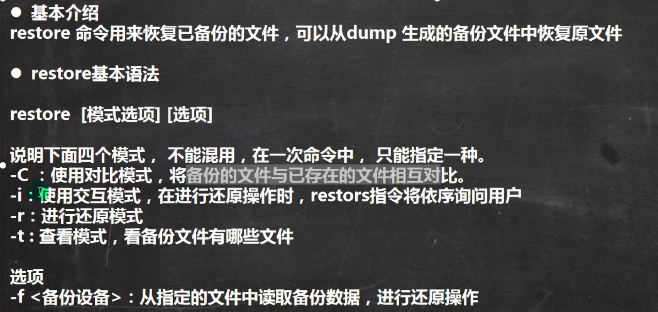

---

# Linux可视化管理

## webmin

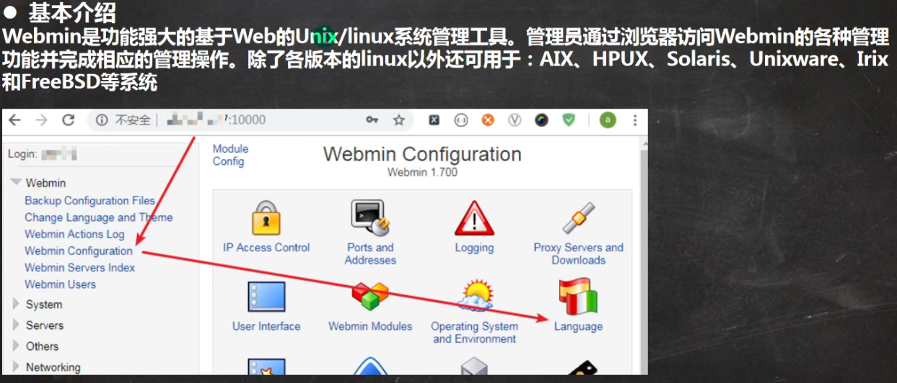

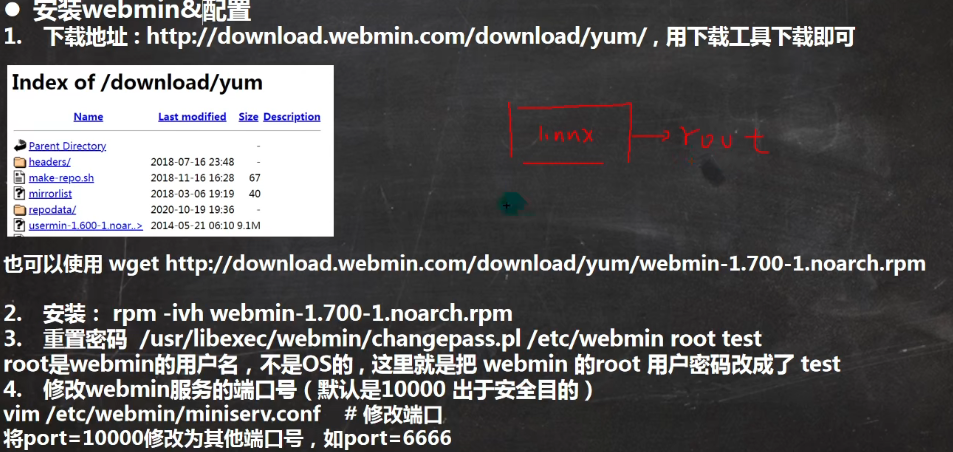

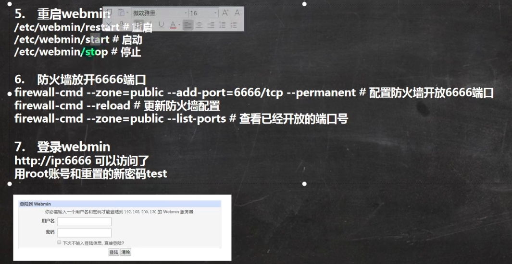

## 宝塔

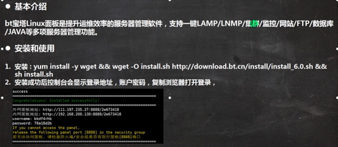

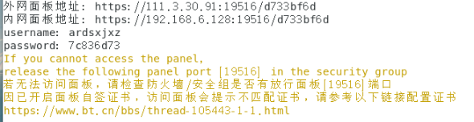

```properties
bt default:查看用户信息
```

---

# 面试题

## cut awt sort uniq

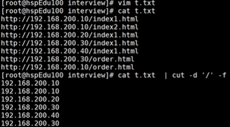


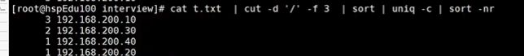


---

## 找回mysql root密码

```mysql
vim /rtc/my.cnf
插入 skip-grant-tables
service mysqld restart 

use mysql;
update user set authentication_string=password("210019") while user='root';

flush privileges;


```

## 其他

> 


> 

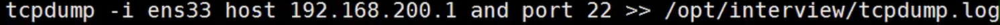

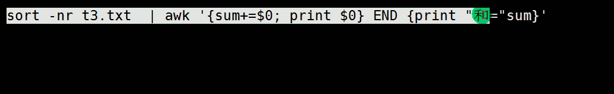
