# 操作系统

# 第一章 操作系统引论

## 操作系统的概念、功能

- MacOS
- Windows
- 安卓
- Linux

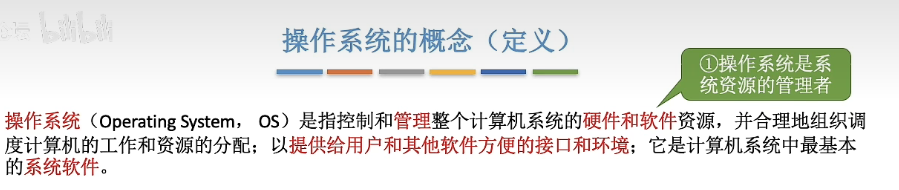

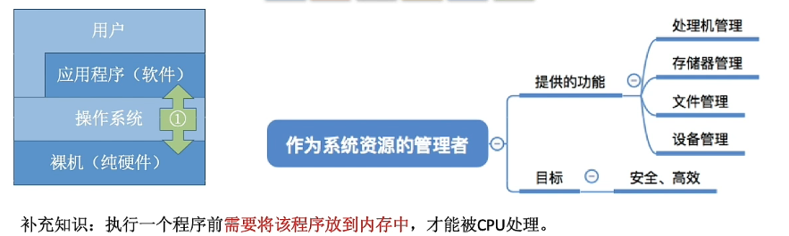

作为用户和计算机硬件之间的接口

- 提供的功能

  - 命令接口（联机命令接口`交互式`|脱机命令接口`.bat`）

  - 程序接口

  - GUI（图形用户界面win|ios|andrio）
- 目标
  - 方便用户使用 

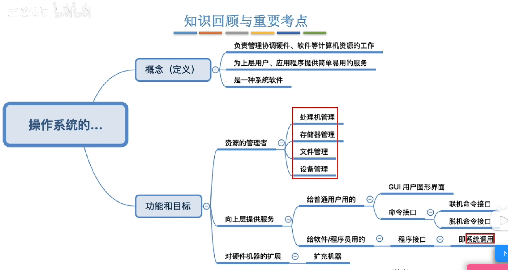

## 操作系统的特征

### 并发|并行

并发：多个事件交替发生（宏观同时发生、微观交替进行）

并行：多个事件同时发生

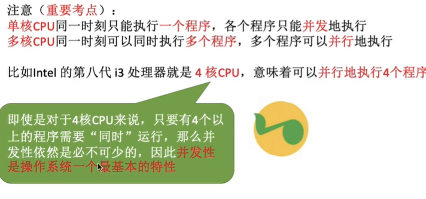

#### 共享

两种资源共享方式

**互斥共享方式**：一个时间段内只允许一个进程访问该资源
**同时共享方式**：允许一个时间段内由多个进程**“同时”**对它们进行访问

### 虚拟

概念：把一个物理上的实体变为若干个逻辑上的对应物

空分复用计数
时分复用计数  

### 异步

概念：在多道程序环境下，允许多个程序并发执行，但由于资源有限，进程的执行不是一贯到底的，而是走走停停的，以不可预知的速度向前推进。只有系统拥有并发性，才有可能导致异步性。 

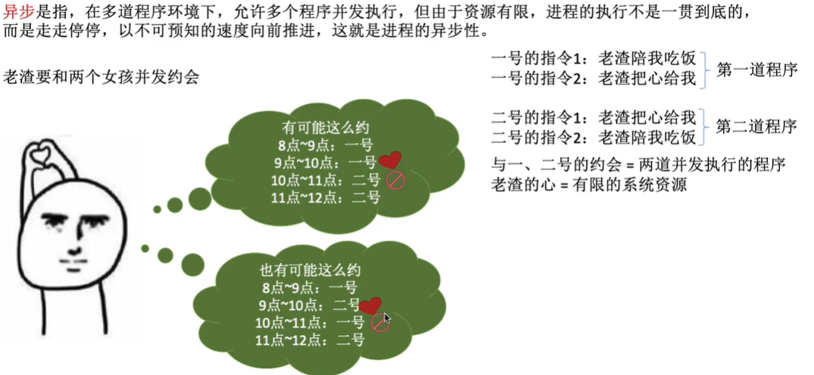

---

## 操作系统的发展与分类

- 手工操作阶段

  - 纸带机（用户独占全机、人机速度矛盾）

    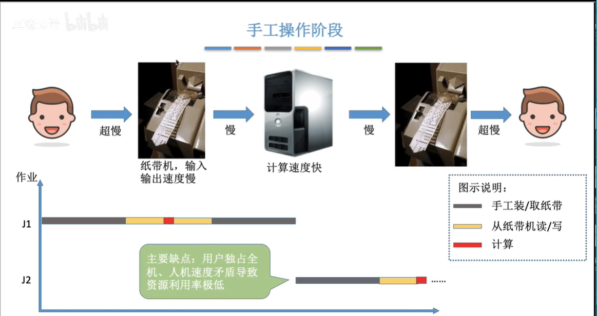

- 批处理阶段——dan'dao
  - 单道批处理系统（外围机——磁带）
  
    
  
    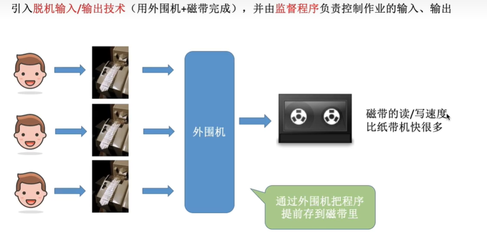
  
    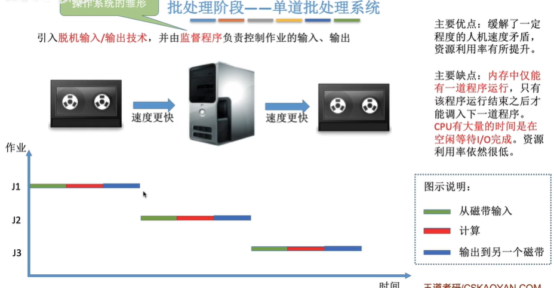
  
    
  
  - 多道批处理系统（操作系统开始出现）
  
    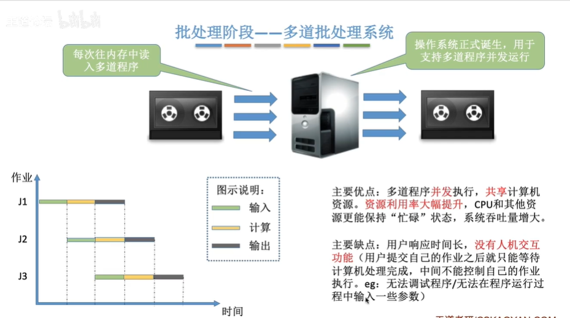
  
- 分时操作系统
  
  
  
  - 轮流处理作业
  - 不能处理紧急任务
  
- 实时操作系统
  
    - 优先处理紧急任务
    - 硬实时系统：必须在严格的时间内完成处理
    - 软实时系统：可以偶尔犯错
    
- 网络操作系统

- 分布式操作系统

- 个人计算机操作系统 

### 概括

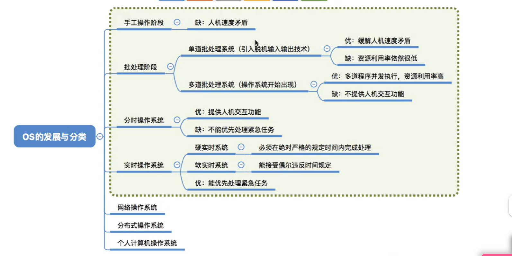

---

## 运行机制

OS的运行机制

- 运行机制

  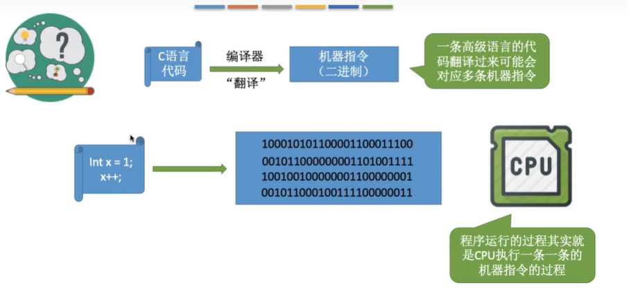

- 两种指令(二进制)
  - 特权指令
  
  - 非特权指令
  
    
  
- 两种处理器状态
  
  
  
  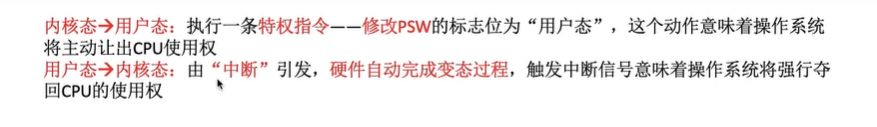
  
  - 核心态（root）
  - 用户态
  
- 两种程序
  - 内核程序(运行在核心态 )
  - 应用程序
  
- 操作系统内核
  - 时钟管理（实现计时功能）
  - 中断处理
  - 原语（程序运行具有原子性，不可中断）
  
- 对系统资源进行管理的功能
  - 进程管理
  - 存储器管理
  - 设备管理
  
- 操作系统的体系结构
  - 大内核（将操作系统的主要功能模块都作为系统内核，运行在核心态）
  - 微内核（只把最基本的功能保留在内核） 

### 概述

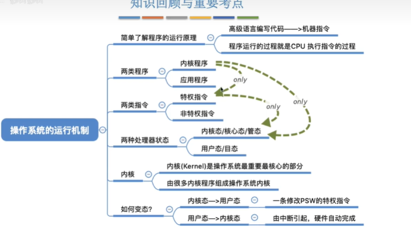

---

## 中断和异常
- 中断机制的诞生
  - 操作系统介入，开展管理工作
  - “用户态—>核心态”是通过中断实现的。并且中断是唯一途径
  
- 中断的概念和作用

- 中断的分类

- 内中断（异常）
  - 陷阱（trap）
  - 故障（fault）
  - 中止（abort）
  
- 外中断  （CPU外部）
  - 外中断的处理过程 
  
    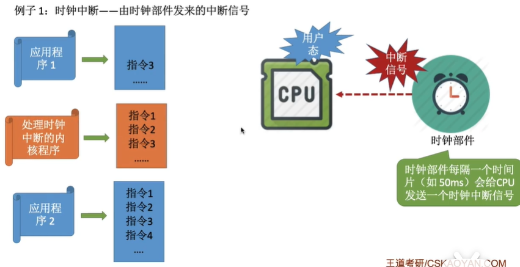

### 概述

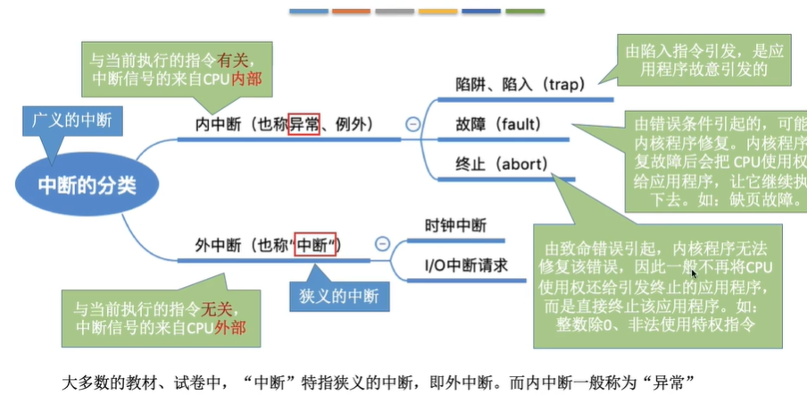

---

## 系统调用

概念：应用程序通过系统调用请求操作系统的服务。保证系统的稳定性和安全性。

系统调用和库函数的区别：

- 系统调用是操作系统向上层提供的接口
- 有的库函数是对系统调用的进一步封装
- 当今编写的应用程序大多是通过高级语言提供的库函数间接地进行系统调用 作者

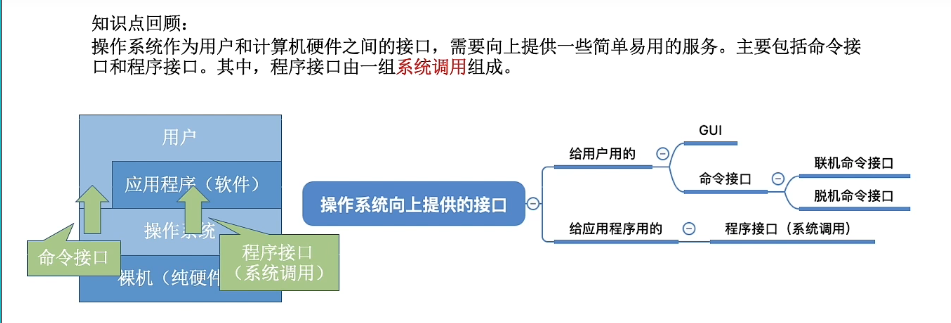

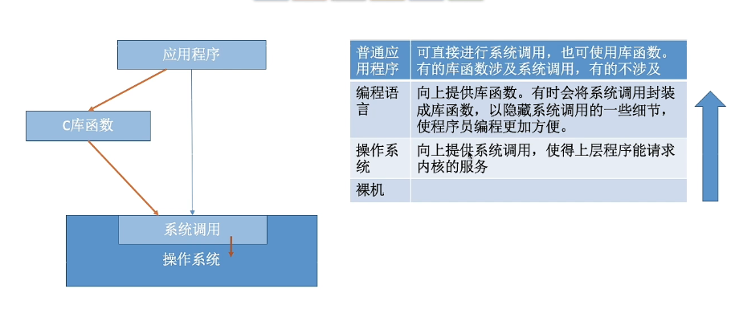

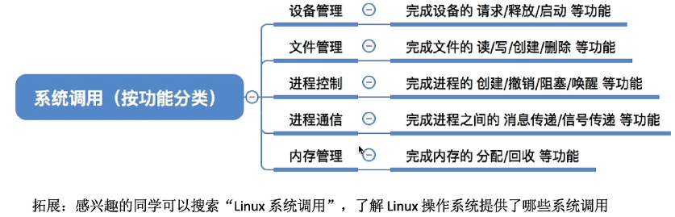

---

## 体系结构

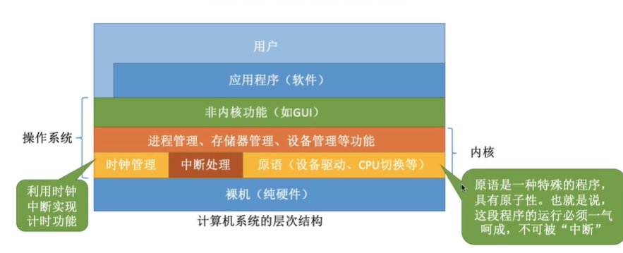

---

## 操作系统的引导

[1.5_操作系统引导_哔哩哔哩_bilibili](https://www.bilibili.com/video/BV1YE411D7nH?p=10&spm_id_from=pageDriver&vd_source=a97555db7a704882626ff6b3dff1617c)

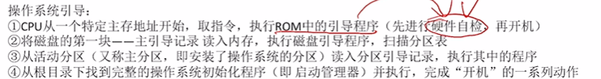

---

# 第二章 进程

## 进程的定义、组成、组织方式、特征

定义：

组成：PCB（进程存在唯一的标志`PID`），程序段，数据段

组织方式：链接方式，指针指向不同的队列；索引方式，索引表

特征：动态性、并发性、独立性、异步性、结构性 

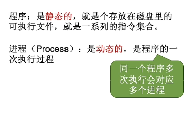

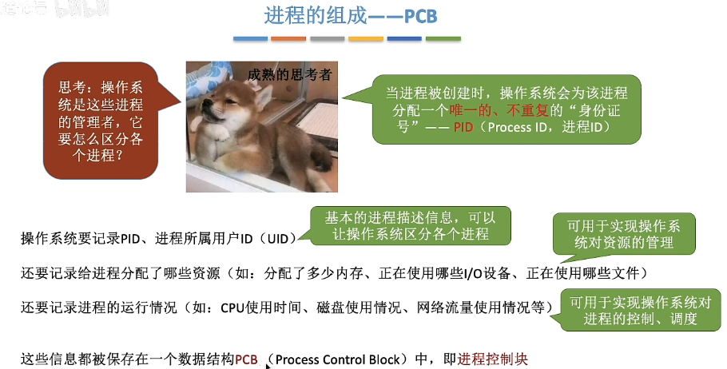

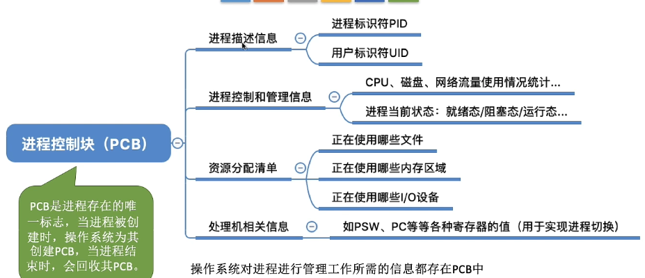

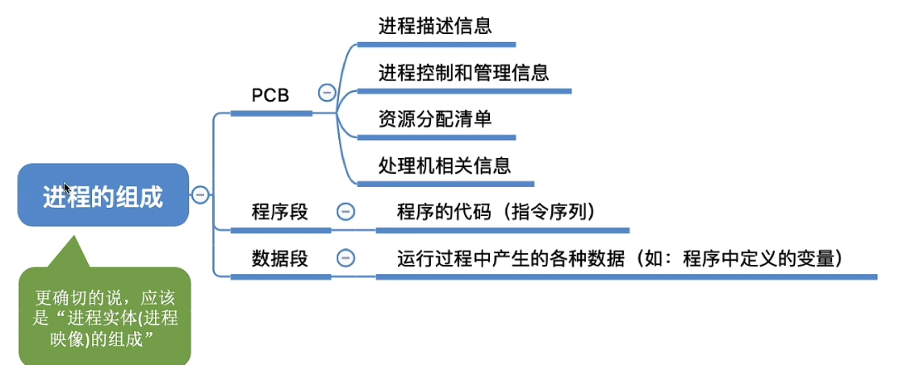

## 状态与转换

> 状态：

- 运行状态：占有CPU，并在CPU上运行，单核只能一个进程（双核两个）（CPU√，其它资源√）

- 就绪状态：已经具备运行条件，但是没有空闲的CPU，暂时不能运行（CPUX，其它资源√）

- 阻塞状态：等在某个事件的发生，暂时不能运行（CPUX，其它资源X）

- 创建状态：创建PCB，程序段，数据段

- 终止状态：回收内存，程序段，数据段，撤销PCB

> 进程状态间的转换(图，且只能这样转化)

- 创建态->就绪态

- 就绪态->运行态

- 运行态->就绪态

- 运行态->中止态（比如数组越界）

- 运行态->阻塞态（主动）

- 阻塞态->就绪态（被动）

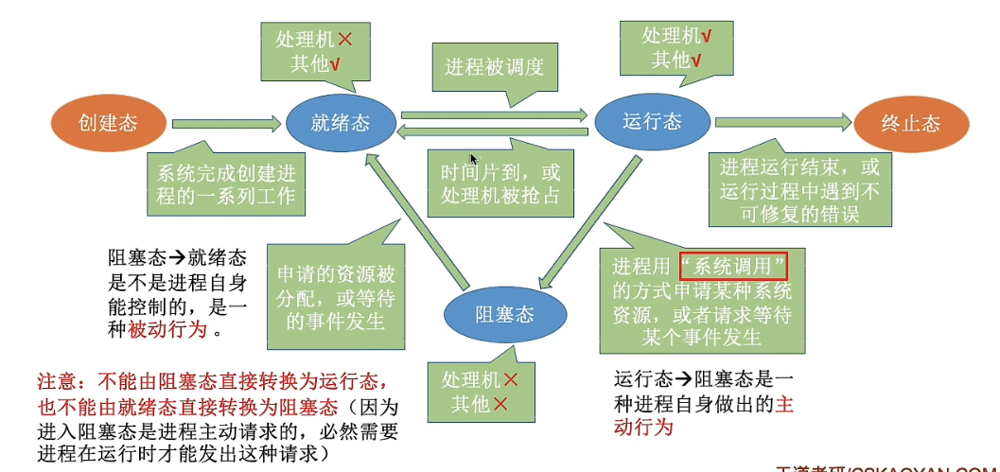

## 进程控制

> 基本概念：
>
> 什么是进程控制？
>
> 答：实现各种进程状态转换。

> 如何实现进程控制？
>
> 答：用“原语”实现。

> 原语做的事情：
>
> 1、更新PCB中的信息
>
> 2、将PCB插入合适的队列
>
> 3、分配/回收资源 

**进程控制相关的原语：**

> 1、进程的创建：

创建原语：

​				申请空白PCB

​				为新进程分配所需资源

​				初始化PCB

​				将PCB插入就绪队列

引起进程创建的事件

​				用户登录

​				作业调度

​				提供服务

​				应用请求

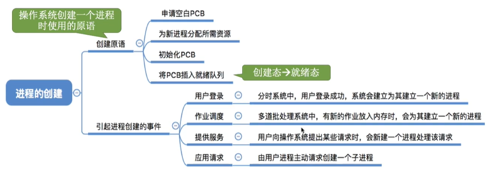

> 2、进程的终止：

撤销原语

引起进程中止的事件：正常结束、异常结束、外界干预

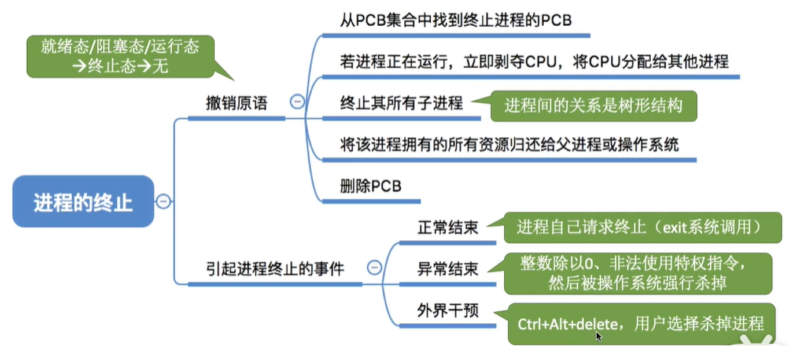

> 3、进程的阻塞：

阻塞原语：运行态->阻塞态

引起进程阻塞的事件：需要等待系统分配某种资源、需要等待相互合作的其他进程完成工作

> 4、进程的唤醒：

唤醒原语：阻塞态->就绪态

引起进程唤醒的事件：等待的事件发生

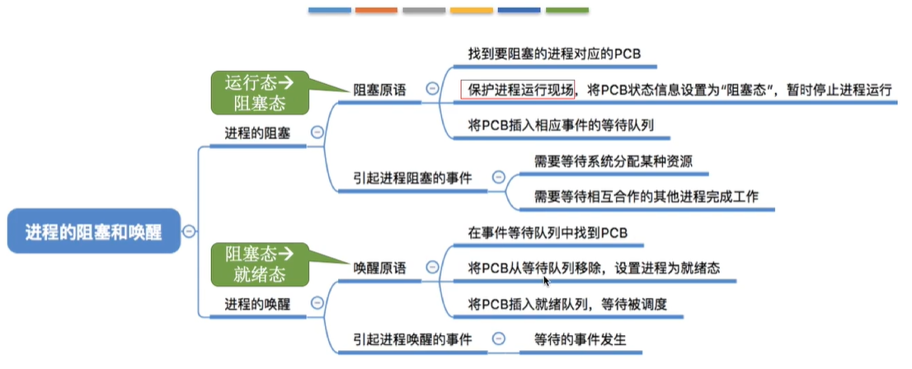

> 5、进程的切换

切换原语

引起进程切换的事件：当前进程事件片到、有更高优先级的进程到达、当前进程主动阻塞、当前进程终止 

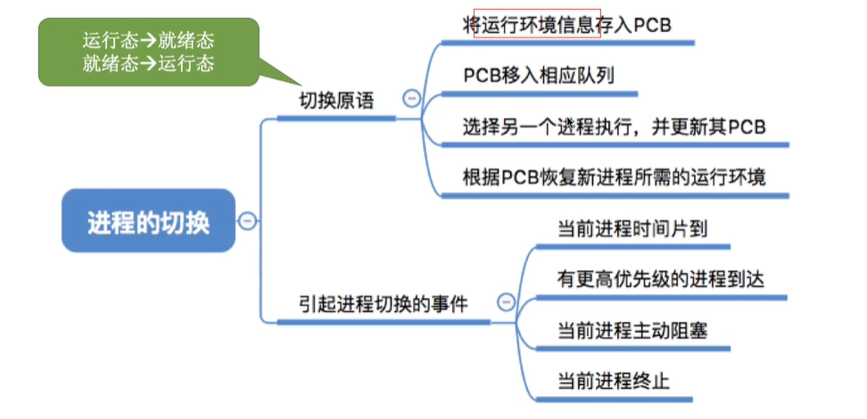
