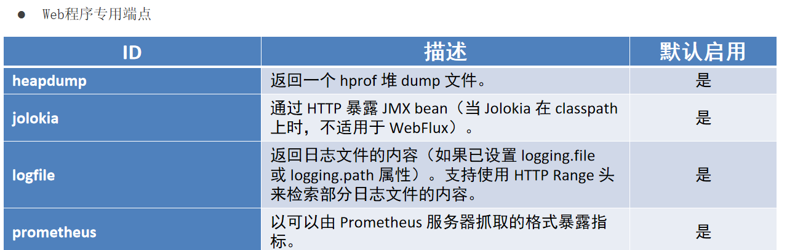
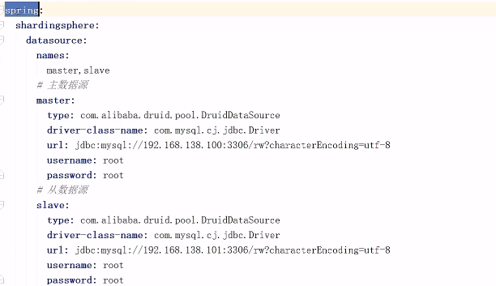
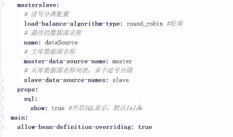
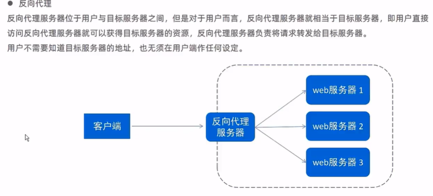

# SpringBoot2

---

# 基础篇

## 初始化

### parent

> 继承，在父pom中，已做好依赖版本管理，导入坐标不需要version

### starter

> 例如 spring-boot-starter-web，整合了web工程所需的依赖

### 引导类

 ```java
 @SpringBootApplication
 public class Springboot0101QuickStartApplication {
     public static void main(String[] args) {
         SpringApplication.run(Springboot0101QuickStartApplication.class, args);
         //获取Spring容器
     }
 }
 ```

> @SpringBootApplication 里 有@Configuration和@ComponentScan（扫描引导类所在包下的所有类）

### 内嵌TomCat

> Spring容器中有Tomcat的对象
>
> 通过exclude排除自带的Tomcat

---

## 基础配置

> 在application.yml中配置

### 属性配置

#### 修改服务器

```yaml
server:
  port: 80
  servlet:
    context-path: /test
```

#### 更改banner

```yaml
spring:
  banner:
    image:
      location: https://i0.hdslb.com/bfs/face/ddc0442e23b68d7494f1922bf485f37b55ca898e.jpg@150w_150h.jpg
 
#spring:
#  main:
#    banner-mode: off
```

> 字符画
>
> ```yaml
> spring:
>   banner:
>     image:
>       location: file:C:\Users\lpl\Desktop\图\表情包\money.jpg
>       bitdepth: 8
>       invert: true
>       pixelmode: block
> ```

---

### yaml

- yaml文件拓展名--> .yaml .yml

#### yaml的书写

```yaml
user:[{username:p,age:18},{username:p,age:17}]
user:
- 
  name:lpl
  age:18
```

#### java调用yml

```java
@Value("${user.age}")
private String age;

/**获取全部数据**/
@Autowird
private Environment env；
    
env.getProperty("user.age")
```

#### 变量引用

```yaml
baseDir: C:\Users\lpl\Desktop\图\他人世界末

spring:
  banner:
    image:
      location: file:${baseDir}\下载.jpg
```

#### 包装成类

```yaml
datasource:
      type: com.alibaba.druid.pool.DruidDataSource
      driver-class-name: com.mysql.cj.jdbc.Driver
      url: jdbc:mysql://localhost:3306/anime_library?characterEncoding=utf8&useSSL=false&serverTimezone=UTC&rewriteBatchedStatements=true&nullCatalogMeansCurrent=true
      username: 2120400146
      password: 210019
```

```java
package com.itheima;

import lombok.Data;
import org.springframework.boot.context.properties.ConfigurationProperties;
import org.springframework.stereotype.Component;

@Data
@Component
@ConfigurationProperties(prefix = "spring.datasource")
public class MyDatasource {

    private String type;
//    private String driver-class-name;
    private String url;
    private String username;
    private String password;
}

 @Autowired
   private MyDatasource myDatasource;

```

---

## 整合第三方技术

### Junit

1.  > 无需配置自带，通过@Autowird获取对象

2. > @SpringBootTest 要在com.itheima的包下面对应启动类所在包
   >
   > ```java
   > @SpringBootTest(class=Application.class)
   > 自行指定
   > ```
   >
   > 

---

### Mybatis

- 核心配置：数据库连接相关信息（连什么？连谁？什么权限）

- 映射配置：SQL映射（XML/注解）

#### 依赖项

```xml
 <dependency>
     <groupId>org.mybatis.spring.boot</groupId>
     <artifactId>mybatis-spring-boot-starter</artifactId>
     <version>2.3.0</version>
</dependency>

<dependency>
    <groupId>com.github.pagehelper</groupId>
    <artifactId>pagehelper-spring-boot-starter</artifactId>
    <version>1.4.6</version>
</dependency>

<dependency>
    <groupId>com.mysql</groupId>
    <artifactId>mysql-connector-j</artifactId>
    <scope>runtime</scope>
</dependency>
        
<dependency>
    <groupId>com.alibaba</groupId>
    <artifactId>druid</artifactId>
    <version>1.2.15</version>
</dependency>
```

#### yml配置

```yaml
spring:
  datasource:
    type: com.alibaba.druid.pool.DruidDataSource
    driver-class-name: com.mysql.cj.jdbc.Driver
    url: jdbc:mysql://localhost:3306/anime_library?characterEncoding=utf8&useSSL=false&serverTimezone=UTC&rewriteBatchedStatements=true&nullCatalogMeansCurrent=true
    username: 2120400146
    password: 210019
  main:
    banner-mode: off
mybatis:
  #实体类
  type-aliases-package: com.itheima.pojo
  #sql
  mapper-locations: classpath:mapper/*Mapper.xml
  configuration:
    #驼峰命名
    map-underscore-to-camel-case: true
    
    
 pagehelper:
  #配置四項 hprs
  helper-dialect: mysql  #分页助手方言：mysql
  params: count=countSql  #为了支持 startPage(Object params) 方法
  support-methods-arguments: true  #支持通过 Mapper 接口参数来传递分页参数，默认值 false
  reasonable: true #分页合理化参数，默认值为 false,页码不为负，不超总页码
```

#### 使用

```java
@Mapper
public interface BangumiMapper {

    @Select("select id, name, type, time, status, year, picture, userId from bangumi limit 0,5")
    public List<Bangumi> getAll();

    public List<Bangumi> test();
}
```

---

### Mybatis-Plus

#### 快速开始

##### 初始化工程

> 创建一个空的SpringBoot工程

##### 添加依赖

```xml
<!--mybatisPlus依赖-->
<dependency>
    <groupId>com.baomidou</groupId>
    <artifactId>mybatis-plus-boot-starter</artifactId>
</dependency>

<!--mysql数据库驱动-->
<dependency>
    <groupId>com.mysql</groupId>
    <artifactId>mysql-connector-j</artifactId>
</dependency>

<dependency>
    <groupId>com.alibaba</groupId>
    <artifactId>druid-spring-boot-starter</artifactId>
    <version>1.2.15</version>
</dependency>

<!--代码生成器-->
<dependency>
    <groupId>com.baomidou</groupId>
    <artifactId>mybatis-plus-generator</artifactId>
    <version>3.4.1</version>
</dependency>

<dependency>
    <groupId>org.apache.velocity</groupId>
    <artifactId>velocity-engine-core</artifactId>
    <version>2.3</version>
</dependency>
```

##### 配置

  ```properties
# yml
spring:
  datasource:
    type: com.alibaba.druid.pool.DruidDataSource
    driver-class-name: com.mysql.cj.jdbc.Driver
    url: jdbc:mysql://localhost:3306/anime_library?characterEncoding=utf8&useSSL=false&serverTimezone=UTC&rewriteBatchedStatements=true&nullCatalogMeansCurrent=true
    username: 2120400146
    password: 210019
  main:
    banner-mode: off
# 开启mp的日志（输出到控制台）
mybatis-plus:
  configuration:
    log-impl: org.apache.ibatis.logging.stdout.StdOutImpl
    map-underscore-to-camel-case: false
  global-config:
    banner: false
  ```

```java
@SpringBootApplication
@MapperScan("com.baomidou.mybatisplus.samples.quickstart.mapper")
//mapper层不用添加@Mapper
//@Mapper自动实现***Mapper的实现类
public class Application {

    public static void main(String[] args) {
        SpringApplication.run(Application.class, args);
    }

}
```

#### 注解

##### @TableName

```java
@TableName("sys_user")
public class User {
    private Long id;
    private String name;
    private Integer age;
    private String email;
}
```

| 属性             | 类型     | 必须指定 | 默认值 | 描述                                                         |
| ---------------- | -------- | -------- | ------ | ------------------------------------------------------------ |
| `value`          | String   | 否       | ""     | 表名                                                         |
| `schema`         | String   | 否       | ""     | schema                                                       |
| keepGlobalPrefix | boolean  | 否       | false  | 是否保持使用全局的 tablePrefix 的值（当全局 tablePrefix 生效时） |
| resultMap        | String   | 否       | ""     | xml 中 resultMap 的 id（用于满足特定类型的实体类对象绑定）   |
| autoResultMap    | boolean  | 否       | false  | 是否自动构建 resultMap 并使用（如果设置 resultMap 则不会进行 resultMap 的自动构建与注入） |
| excludeProperty  | String[] | 否       | {}     | 需要排除的属性名 @since 3.3.1                                |

##### @TableId

- 描述：主键注解
- 使用位置：实体类主键字段

| 属性  | 类型   | 必须指定 | 默认值      | 描述         |
| ----- | ------ | -------- | ----------- | ------------ |
| value | String | 否       | ""          | 主键字段名   |
| type  | Enum   | 否       | IdType.NONE | 指定主键类型 |

```java
@TableName("sys_user")
public class User {
    @TableId(value = "id", type = IdType.AUTO)
    private Long id;
    private String name;
    private Integer age;
    private String email;
}
```

IdType

| 值          | 描述                                                         |
| ----------- | ------------------------------------------------------------ |
| AUTO        | 数据库 ID 自增                                               |
| NONE        | 无状态，该类型为未设置主键类型（注解里等于跟随全局，全局里约等于 INPUT） |
| INPUT       | insert 前自行 set 主键值                                     |
| ASSIGN_ID   | 分配 ID(主键类型为 Number(Long 和 Integer)或 String)(since 3.3.0),使用接口`IdentifierGenerator`的方法`nextId`(默认实现类为`DefaultIdentifierGenerator`雪花算法) |
| ASSIGN_UUID | 分配 UUID,主键类型为 String(since 3.3.0),使用接口`IdentifierGenerator`的方法`nextUUID`(默认 default 方法) |

##### [@TableField](https://github.com/baomidou/mybatis-plus/blob/3.0/mybatis-plus-annotation/src/main/java/com/baomidou/mybatisplus/annotation/TableField.java)

- 描述：字段注解（非主键）

```java
@TableName("sys_user")
public class User {
    @TableId
    private Long id;
    @TableField("nickname")
    private String name;
    private Integer age;
    private String email;
}
```

| 属性             | 类型                         | 必须指定 | 默认值                   | 描述                                                         |
| ---------------- | ---------------------------- | -------- | ------------------------ | ------------------------------------------------------------ |
| `value`          | String                       | 否       | ""                       | 数据库字段名                                                 |
| `exist`          | boolean                      | 否       | true                     | 是否为数据库表字段                                           |
| `condition`      | String                       | 否       | ""                       | 字段 `where` 实体查询比较条件，有值设置则按设置的值为准，没有则为默认全局的 `%s=#{%s}`，[参考(opens new window)](https://github.com/baomidou/mybatis-plus/blob/3.0/mybatis-plus-annotation/src/main/java/com/baomidou/mybatisplus/annotation/SqlCondition.java) |
| `update`         | String                       | 否       | ""                       | 字段 `update set` 部分注入，例如：当在version字段上注解`update="%s+1"` 表示更新时会 `set version=version+1` （该属性优先级高于 `el` 属性） |
| insertStrategy   | Enum                         | 否       | FieldStrategy.DEFAULT    | 举例：NOT_NULL `insert into table_a(<if test="columnProperty != null">column</if>) values (<if test="columnProperty != null">#{columnProperty}</if>)` |
| updateStrategy   | Enum                         | 否       | FieldStrategy.DEFAULT    | 举例：IGNORED `update table_a set column=#{columnProperty}`  |
| whereStrategy    | Enum                         | 否       | FieldStrategy.DEFAULT    | 举例：NOT_EMPTY `where <if test="columnProperty != null and columnProperty!=''">column=#{columnProperty}</if>` |
| fill             | Enum                         | 否       | FieldFill.DEFAULT        | 字段自动填充策略                                             |
| select           | boolean                      | 否       | true                     | 是否进行 select 查询                                         |
| keepGlobalFormat | boolean                      | 否       | false                    | 是否保持使用全局的 format 进行处理                           |
| jdbcType         | JdbcType                     | 否       | JdbcType.UNDEFINED       | JDBC 类型 (该默认值不代表会按照该值生效)                     |
| typeHandler      | Class<? extends TypeHandler> | 否       | UnknownTypeHandler.class | 类型处理器 (该默认值不代表会按照该值生效)                    |
| `numericScale`   | String                       | 否       | ""                       | 指定小数点后保留的位数                                       |

##### [@TableLogic](https://github.com/baomidou/mybatis-plus/blob/3.0/mybatis-plus-annotation/src/main/java/com/baomidou/mybatisplus/annotation/TableLogic.java)

- 描述：表字段逻辑处理注解（逻辑删除）

| 属性   | 类型   | 必须指定 | 默认值 | 描述         |
| ------ | ------ | -------- | ------ | ------------ |
| value  | String | 否       | ""     | 逻辑未删除值 |
| delval | String | 否       | ""     | 逻辑删除值   |

#### 代码生成器

##### 3.5.1（新）

```xml
<dependency>
    <groupId>com.baomidou</groupId>
    <artifactId>mybatis-plus-boot-starter</artifactId>
    <version>3.5.3.1</version>
</dependency>

<dependency>
    <groupId>com.baomidou</groupId>
    <artifactId>mybatis-plus-generator</artifactId>
    <version>最新版本</version>
</dependency>

 <dependency>
     <groupId>org.springframework.boot</groupId>
     <artifactId>spring-boot-starter-freemarker</artifactId>
</dependency>

<dependency>
    <groupId>com.mysql</groupId>
    <artifactId>mysql-connector-j</artifactId>
</dependency>

<dependency>
    <groupId>com.alibaba</groupId>
    <artifactId>druid-spring-boot-starter</artifactId>
    <version>1.2.16</version>
</dependency>
```

```java
package com.mybatis;

import com.baomidou.mybatisplus.core.mapper.BaseMapper;
import com.baomidou.mybatisplus.generator.FastAutoGenerator;
import com.baomidou.mybatisplus.generator.config.OutputFile;
import com.baomidou.mybatisplus.generator.config.rules.NamingStrategy;
import com.baomidou.mybatisplus.generator.engine.FreemarkerTemplateEngine;

import javax.naming.spi.NamingManager;
import java.util.Collections;


public class MybatisPlusGenerator {
    public static void main(String[] args) {
        create();
    }

    public static void create() {
        //1.获取代码生成器对象
        FastAutoGenerator
                //2.数据库相关配置
                .create(
                        "jdbc:mysql://localhost:3306/sg_blog?characterEncoding=utf8&useSSL=false&serverTimezone=UTC&rewriteBatchedStatements=true&nullCatalogMeansCurrent=true",
                        "2120400146",
                        "210019")
                //3.全局配置
                .globalConfig(builder -> {

                    builder
                            // 设置作者
                            .author("baomidou")
                            // 开启 swagger 模式
                            .enableSwagger()
                            // 覆盖已生成文件
                            .fileOverride()
                            // 指定输出目录
                            .outputDir(System.getProperty("user.dir") + "/mybatisplus_05_HighVersion/src/main/java/")
                            .commentDate("yyyy-MM-dd");
                })
                //4.包设置
                .packageConfig(builder -> {
                    builder
                            //设置包名
                            .parent("com.mybatis")
                            //实体类包名
                            .entity("pojo")
                            //服务层包名
                            .service("service")
                            //服务层实现类名
                            .serviceImpl("service.serviceImpl")
                            //controller
                            .controller("controller")
                            //mapper
                            .mapper("mapper")
                            //mapper sql.xml
                            .xml("mapper")
                            // 设置mapperXml生成路径
                            .pathInfo(Collections.singletonMap(OutputFile.xml, System.getProperty("user.dir") + "/mybatisplus_05_HighVersion/src/main/resources/"));
                })
                //5.策略设置
                .strategyConfig(builder -> {
                    builder
                            //设置需要生成的表名
                            .addInclude("sg_link", "sg_tag")
                            // 设置过滤表前缀
                            .addTablePrefix("sg_")

                            .serviceBuilder()
                            .formatServiceFileName("%sService")
                            .formatServiceImplFileName("%sServiceImpl")

                            .entityBuilder()
                            //开启lombok
                            .enableLombok()
                            //逻辑删除
                            .logicDeleteColumnName("delFlag")
                            .enableTableFieldAnnotation()
                            .naming(NamingStrategy.underline_to_camel)
                            .columnNaming(NamingStrategy.underline_to_camel)

                            .controllerBuilder()
                            .formatFileName("%sController")
                            //开启RestController
                            .enableRestStyle()


                            .mapperBuilder()
                            //继承哪个父类
                            .superClass(BaseMapper.class)
                            .formatMapperFileName("%sMapper")
                            //@Mapper
                            .enableMapperAnnotation()
                            .formatXmlFileName("%sMapper");


                })
                .templateEngine(new FreemarkerTemplateEngine()) // 使用Freemarker引擎模板，默认的是Velocity引擎模板
                .execute();
    }
}
```

##### 旧

```java
import com.baomidou.mybatisplus.generator.AutoGenerator;
import com.baomidou.mybatisplus.generator.config.DataSourceConfig;
import com.baomidou.mybatisplus.generator.config.GlobalConfig;
import com.baomidou.mybatisplus.generator.config.PackageConfig;
import com.baomidou.mybatisplus.generator.config.StrategyConfig;
import com.baomidou.mybatisplus.generator.config.rules.NamingStrategy;

public class CodeGenerator {
    public static void main(String[] args) {
        //1.获取代码生成器的对象
        AutoGenerator autoGenerator = new AutoGenerator();

        //2.设置数据库相关配置
        DataSourceConfig dataSource = new DataSourceConfig();
        dataSource.setDriverName("com.mysql.cj.jdbc.Driver");
        dataSource.setUrl("jdbc:mysql://localhost:3306/sg_blog?characterEncoding=utf8&useSSL=false&serverTimezone=UTC&rewriteBatchedStatements=true&nullCatalogMeansCurrent=true");
        dataSource.setUsername("2120400146");
        dataSource.setPassword("210019");
        autoGenerator.setDataSource(dataSource);

        //3.设置全局配置
        com.baomidou.mybatisplus.generator.config.GlobalConfig globalConfig = new GlobalConfig();
        globalConfig.setOutputDir(System.getProperty("user.dir")+"/sangeng-framework/src/main/java/");    //设置代码生成位置
        globalConfig.setOpen(false);    //设置生成完毕后是否打开生成代码所在的目录
        globalConfig.setAuthor("lpl");    //设置作者
        globalConfig.setFileOverride(true);     //设置是否覆盖原始生成的文件
        globalConfig.setMapperName("%sMapper");    //设置数据层接口名，%s为占位符，指代模块名称
//        globalConfig.setIdType(IdType.AUTO);   //设置Id生成策略
        autoGenerator.setGlobalConfig(globalConfig);


        //4.设置包名相关配置
        PackageConfig packageInfo = new PackageConfig();
        packageInfo.setParent("com.sangeng");   //设置生成的包名，与代码所在位置不冲突，二者叠加组成完整路径
        packageInfo.setEntity("pojo.entity");    //设置实体类包名
        packageInfo.setMapper("mapper");   //设置数据层包名
        autoGenerator.setPackageInfo(packageInfo);

        //5.策略设置
        StrategyConfig strategyConfig = new StrategyConfig();
        strategyConfig.setInclude("sys_user_role");  //设置当前参与生成的表名，参数为可变参数
        strategyConfig.setTablePrefix("sys_");  //设置数据库表的前缀名称，模块名 = 数据库表名 - 前缀名  例如： User = tbl_user - tbl_
        strategyConfig.setRestControllerStyle(true);    //设置是否启用Rest风格
//        strategyConfig.setVersionFieldName("version");  //设置乐观锁字段名
//        strategyConfig.setLogicDeleteFieldName("deleted");  //设置逻辑删除字段名
        strategyConfig.setNaming(NamingStrategy.underline_to_camel);
        strategyConfig.setColumnNaming(NamingStrategy.underline_to_camel);
        strategyConfig.setEntityLombokModel(true);  //设置是否启用lombok
        autoGenerator.setStrategy(strategyConfig);

        //6.执行生成操作
        autoGenerator.execute();


    }
}

```

#### [CRUD 接口](https://www.baomidou.com/pages/49cc81/)

##### Service

- save

  ```java
  // 插入一条记录（选择字段，策略插入
  boolean save(T entity);
  // 插入（批量）
  boolean saveBatch(Collection<T> entityList);
  // 插入（批量）
  boolean saveBatch(Collection<T> entityList, int batchSize);
  ```

- saveOrUpdate

  ```java
  // TableId 注解存在更新记录，否插入一条记录
  boolean saveOrUpdate(T entity);
  // 根据updateWrapper尝试更新，否继续执行saveOrUpdate(T)方法
  boolean saveOrUpdate(T entity, Wrapper<T> updateWrapper);
  // 批量修改插入
  boolean saveOrUpdateBatch(Collection<T> entityList);
  // 批量修改插入
  boolean saveOrUpdateBatch(Collection<T> entityList, int batchSize);
  ```

- remove

  ```java
  // 根据 queryWrapper 设置的条件，删除记录
  boolean remove(Wrapper<T> queryWrapper);
  // 根据 ID 删除
  boolean removeById(Serializable id);
  // 根据 columnMap 条件，删除记录
  boolean removeByMap(Map<String, Object> columnMap);
  // 删除（根据ID 批量删除）
  boolean removeByIds(Collection<? extends Serializable> idList);
  ```

- update

  ```java
  // 根据 UpdateWrapper 条件，更新记录 需要设置sqlset
  boolean update(Wrapper<T> updateWrapper);
  // 根据 whereWrapper 条件，更新记录
  boolean update(T updateEntity, Wrapper<T> whereWrapper);
  // 根据 ID 选择修改
  boolean updateById(T entity);
  // 根据ID 批量更新
  boolean updateBatchById(Collection<T> entityList);
  // 根据ID 批量更新
  boolean updateBatchById(Collection<T> entityList, int batchSize);
  ```

- get

  ```java
  // 根据 ID 查询
  T getById(Serializable id);
  // 根据 Wrapper，查询一条记录。结果集，如果是多个会抛出异常，随机取一条加上限制条件 wrapper.last("LIMIT 1")
  T getOne(Wrapper<T> queryWrapper);
  // 根据 Wrapper，查询一条记录
  T getOne(Wrapper<T> queryWrapper, boolean throwEx);
  // 根据 Wrapper，查询一条记录
  Map<String, Object> getMap(Wrapper<T> queryWrapper);
  // 根据 Wrapper，查询一条记录
  <V> V getObj(Wrapper<T> queryWrapper, Function<? super Object, V> mapper);
  ```

- .......

##### Mapper


---

## SSMP 整合

### 步骤

> 1. pom.xml              配置起步依赖
> 2. application.yml       设置数据源，端口，框架技术相关配置等
> 3. mapper               继承BaseMapper，设置@Mapper
> 4. mapper               测试类
> 5. service              调用数据层接口或Mp的接口开发
> 6. service              测试类
> 7. controller           基于Restful开发，使用postman测试
> 8. 页面                 放在resource目录下的static目录中


---

# 运维使用篇

## 打包与运行

### 打包

> maven:package :package:


### 运行

> cmd:java -jar jar文件
>
> 注意: 会运行test

**常用命令**

> \# 查询端口
>
> netstat -ano
>
> \# 查询指定端口
>
> netstat -ano |findstr "端口号"
>
> \# 根据进程PID查询进程名称
>
> tasklist |findstr "进程PID号"
>
> \# 根据PID杀死任务
>
> taskkill /F /PID "进程PID号"
>
> \# 根据进程名称杀死任务
>
> taskkill -f -t -im "进程名称

---

## 配置高级

### 临时属性配置

> cmd:java -jar jar文件 --server.port:8080


### **多环境配置**


### 自定义配置文件（yml）

**(自定义配置文件名字)**

> --spring.config.name=ebank
>
> --spring.config.location=classpath:/ebank.yml，classpath:/server.yml

---

## 多环境开发

> 看PPT，目前用得不多

### yaml版

```yaml
# 应用环境
# 公共配置
spring:
  profiles:
    active: dev
---
# 设置环境
# 生产环境
spring:
  profiles: pro
server:
  port: 80
---
# 开发环境
spring:
  profiles: dev
server:
  port: 81
---
# 测试环境
spring:
  config:
    activate:
      on-profile: test
server:
  port: 82
```

### properties

---

## 日志

### 日志基础

```java
package com.itheima.Controller;

import org.slf4j.Logger;
import org.slf4j.LoggerFactory;
import org.springframework.web.bind.annotation.GetMapping;
import org.springframework.web.bind.annotation.RequestMapping;
import org.springframework.web.bind.annotation.RestController;

@Slf4j
@RestController
@RequestMapping("/books")
public class BookController extend BaseClass{

    //创建记录对象
    //private static final Logger log= LoggerFactory.getLogger(this.getClass());

    @GetMapping
    public String geById(){
        System.out.println("running");

        log.debug("debug");
        log.info("info");
        log.warn("warn");
        log.error("error");

        return "running";
    }
}

public class BaseClass {
    private Class clazz ;
    public static Logger log ;

    public BaseClass(){
        clazz = this.getClass();
        log = LoggerFactory.getLogger(clazz);
    }

}

```

```yaml
server:
  port: 80

#debug: true
logging:

  group: 
    ebank: com.itheima.controller
  level:
    root: error
    ebank: debug
    com.itheima.controller: debug
```

### 日志输出格式控制


### 日志文件

---

```yaml
logging:
  file:
    path: C:\Users\lpl\Desktop
   
```

```xml
<?xml version="1.0" encoding="UTF-8"?>
<configuration>
    <contextName>community</contextName>
    <property name="LOG_PATH" value="C:\Users\lpl\Desktop"/>
    <property name="APPDIR" value="community"/>

    <!-- error file -->
    <appender name="FILE_ERROR" class="ch.qos.logback.core.rolling.RollingFileAppender">
        <file>${LOG_PATH}/${APPDIR}/log_error.log</file>
        <rollingPolicy class="ch.qos.logback.core.rolling.TimeBasedRollingPolicy">
            <fileNamePattern>${LOG_PATH}/${APPDIR}/error/log-error-%d{yyyy-MM-dd}.%i.log</fileNamePattern>
            <timeBasedFileNamingAndTriggeringPolicy class="ch.qos.logback.core.rolling.SizeAndTimeBasedFNATP">
                <maxFileSize>5MB</maxFileSize>
            </timeBasedFileNamingAndTriggeringPolicy>
            <maxHistory>30</maxHistory>
        </rollingPolicy>
        <append>true</append>
        <encoder class="ch.qos.logback.classic.encoder.PatternLayoutEncoder">
            <pattern>%d %level [%thread] %logger{10} [%file:%line] %msg%n</pattern>
            <charset>utf-8</charset>
        </encoder>
        <filter class="ch.qos.logback.classic.filter.LevelFilter">
            <level>error</level>
            <onMatch>ACCEPT</onMatch>
            <onMismatch>DENY</onMismatch>
        </filter>
    </appender>

    <!-- warn file -->
    <appender name="FILE_WARN" class="ch.qos.logback.core.rolling.RollingFileAppender">
        <file>${LOG_PATH}/${APPDIR}/log_warn.log</file>
        <rollingPolicy class="ch.qos.logback.core.rolling.TimeBasedRollingPolicy">
            <fileNamePattern>${LOG_PATH}/${APPDIR}/warn/log-warn-%d{yyyy-MM-dd}.%i.log</fileNamePattern>
            <timeBasedFileNamingAndTriggeringPolicy class="ch.qos.logback.core.rolling.SizeAndTimeBasedFNATP">
                <maxFileSize>5MB</maxFileSize>
            </timeBasedFileNamingAndTriggeringPolicy>
            <maxHistory>30</maxHistory>
        </rollingPolicy>
        <append>true</append>
        <encoder class="ch.qos.logback.classic.encoder.PatternLayoutEncoder">
            <pattern>%d %level [%thread] %logger{10} [%file:%line] %msg%n</pattern>
            <charset>utf-8</charset>
        </encoder>
        <filter class="ch.qos.logback.classic.filter.LevelFilter">
            <level>warn</level>
            <onMatch>ACCEPT</onMatch>
            <onMismatch>DENY</onMismatch>
        </filter>
    </appender>

    <!-- info file -->
    <appender name="FILE_INFO" class="ch.qos.logback.core.rolling.RollingFileAppender">
        <file>${LOG_PATH}/${APPDIR}/log_info.log</file>
        <rollingPolicy class="ch.qos.logback.core.rolling.TimeBasedRollingPolicy">
            <fileNamePattern>${LOG_PATH}/${APPDIR}/info/log-info-%d{yyyy-MM-dd}.%i.log</fileNamePattern>
            <timeBasedFileNamingAndTriggeringPolicy class="ch.qos.logback.core.rolling.SizeAndTimeBasedFNATP">
                <maxFileSize>5MB</maxFileSize>
            </timeBasedFileNamingAndTriggeringPolicy>
            <maxHistory>30</maxHistory>
        </rollingPolicy>
        <append>true</append>
        <encoder class="ch.qos.logback.classic.encoder.PatternLayoutEncoder">
            <pattern>%d %level [%thread] %logger{10} [%file:%line] %msg%n</pattern>
            <charset>utf-8</charset>
        </encoder>
        <filter class="ch.qos.logback.classic.filter.LevelFilter">
            <level>info</level>
            <onMatch>ACCEPT</onMatch>
            <onMismatch>DENY</onMismatch>
        </filter>
    </appender>

    <!-- console -->
    <appender name="STDOUT" class="ch.qos.logback.core.ConsoleAppender">
        <encoder>
            <pattern>%d %level [%thread] %logger{10} [%file:%line] %msg%n</pattern>
            <charset>utf-8</charset>
        </encoder>
        <filter class="ch.qos.logback.classic.filter.ThresholdFilter">
            <level>debug</level>
        </filter>
    </appender>

    <logger name="com.nowcoder.community" level="debug"/>

    <root level="info">
        <appender-ref ref="FILE_ERROR"/>
        <appender-ref ref="FILE_WARN"/>
        <appender-ref ref="FILE_INFO"/>
        <appender-ref ref="STDOUT"/>
    </root>

</configuration>	
```

---

# 开发实用篇

## 热部署

### 配置

```xml
<dependency>
    <groupId>org.springframework.boot</groupId>
    <artifactId>spring-boot-devtools</artifactId>    
    <optional>true</optional>
</dependency>
```

> ctrl+F9 启动
>
> 热部署仅仅加载当前开发者的资源，不加载jar资源

### 热部署范围配置

默认不触发重启的目录列表

- /META-INF/maven
- /META-INF/resources
- /resources
- /static
- /public
- /templates

- 自定义不参与重启排除项

```yaml
devtools:
  restart:
     exclude: public/**,static/**
```

### 禁用热部署

- 设置高优先级属性禁用热部署

```java
public static void main(String[] args) {  System.setProperty("spring.devtools.restart.enabled", "false");    SpringApplication.run(SSMPApplication.class);
}
```

---

## 配置高级

### 第三方Bean属性绑定

```java
@Bean
@ConfigurationProperties(prefix = "spring.datasource")
    public DruidDataSource dataSource() {
        DruidDataSource dataSource = new DruidDataSource();
        return dataSource;
}
```

```java
@EnableConfigurationProperties(ServletConfig.class)

/**/
package com.itheima.config;

import lombok.Data;
import org.springframework.boot.context.properties.ConfigurationProperties;
import org.springframework.stereotype.Component;

//@Component //定义为一个组件，bean
@Data
@ConfigurationProperties(prefix = "servers")
public class ServletConfig {
    private String ipAddress;
    private int port;
    private long timeout;
}

```

### 宽松绑定


### 常用计量单位

> SpringBoot支持JDK8提供的时间与空间计量单位
>
> ```java
> @Component
> @Data
> @ConfigurationProperties(prefix = "servers")
> public class ServerConfig {
>     private String ipAddress;
>     private int port;
>     private long timeout;
>     @DurationUnit(ChronoUnit.MINUTES)
>     private Duration serverTimeOut;
>     @DataSizeUnit(DataUnit.MEGABYTES)
>     private DataSize dataSize;
>  }
> 
> ```
>
> 

### Bean 数据校验

```xml
<dependency>
	<groupId>javax.validation</groupId>
 	<artifactId>validation-api</artifactId>
</dependency>

<dependency>
    <groupId>org.hibernate.validator</groupId>
    <artifactId>hibernate-validator</artifactId>
</dependency>

```

```java
@Validated
public class ServerConfig {
    @Max(value = 400,message = "最大值不能超过400")
    private int port;
}
```

### 进制数据转换规则

```yaml
boolean: TRUE  		  				     #TRUE,true,True,FALSE,false，False均可
float: 3.14    							#6.8523015e+5  #支持科学计数法
int: 123       							 #0b1010_0111_0100_1010_1110    #支持二进制、八进制、十六进制
null: ~        							  #使用~表示null
string: HelloWorld      			 	      #字符串可以直接书写
string2: "Hello World"  			            #可以使用双引号包裹特殊字符
date: 2018-02-17        			            #日期必须使用yyyy-MM-dd格式
datetime: 2018-02-17T15:02:31+08:00            #时间和日期之间使用T连接，最后使用+代表时区
```

---

## 测试

### 临时属性

```java
@SpringBootTest(properties = {"test.prop=1"})//优先级高
@SpringBootTest(args = {"--test.prop=2"})

test:
  prop: testValue
```

### 加载专用配置

```java
@SpringBootTest
@Import({MsgConfig.class})
public class MsgTest {

    @Autowired
    private String msg;

    @Test
    void test(){
        System.out.println("msg = " + msg);
    }
}


public class MsgConfig {

    @Bean
    public String msg(){
        return "bean msg";
    }

}

```

### web环境

```java
@SpringBootTest(webEnvironment = SpringBootTest.WebEnvironment.DEFINED_PORT)

@SpringBootTest(webEnvironment = SpringBootTest.WebEnvironment.RANDOM_PORT)
public class WebTest {
    /**
     * 测试不会启动Tomcat
     @SpringBootTest(webEnvironment = SpringBootTest.WebEnvironment.NONE)
     */
    @Test
    void web(){

    }
}
```

### 发送虚拟请求

#### 基本使用

```java
@AutoConfigureMockMvc
@SpringBootTest(webEnvironment = SpringBootTest.WebEnvironment.DEFINED_PORT)
public class WebTest {
    /**
     * 测试不会启动Tomcat
     */

    @Autowired MockMvc mockMvc;

    @SneakyThrows
    @Test
    void web() {
        MockHttpServletRequestBuilder builder = MockMvcRequestBuilders.get("/books");
        mockMvc.perform(builder);
    }
}

```

#### 匹配相应执行状态

```properties
java.lang.AssertionError: Status expected:<404> but was:<200>
预期:404
实际:200
<点击以查看差异>
```

```java
@SpringBootTest(webEnvironment = SpringBootTest.WebEnvironment.DEFINED_PORT)
@AutoConfigureMockMvc
public class WebTest {
    /**
     * 测试不会启动Tomcat
     */

    @Autowired
    MockMvc mockMvc;

    @SneakyThrows
    @Test
    void web() {
        MockHttpServletRequestBuilder builder = MockMvcRequestBuilders.get("/books");
        mockMvc.perform(builder);
    }

    @SneakyThrows
    @Test
    void status() {
        MockHttpServletRequestBuilder builder = MockMvcRequestBuilders.get("/books");
        ResultActions perform = mockMvc.perform(builder);

        StatusResultMatchers status = MockMvcResultMatchers.status();
        ResultMatcher ok = status.isNotFound();

        perform.andExpect(ok);

    }

    @SneakyThrows
    @Test
    void body() {
        MockHttpServletRequestBuilder builder = MockMvcRequestBuilders.get("/books");
        ResultActions perform = mockMvc.perform(builder);

        ContentResultMatchers content = MockMvcResultMatchers.content();

        ResultMatcher get = content.string("get");

        perform.andExpect(get);
    }

    @SneakyThrows
    @Test
    void json() {
        MockHttpServletRequestBuilder builder = MockMvcRequestBuilders.get("/books");
        ResultActions perform = mockMvc.perform(builder);
        ContentResultMatchers content = MockMvcResultMatchers.content();


        ResultMatcher get = content.json("{\"id\":1}");

        perform.andExpect(get);
    }

    @Test
    public void testContentType(@Autowired MockMvc mvc) throws Exception {
        MockHttpServletRequestBuilder builder = MockMvcRequestBuilders.get("/books");
        ResultActions action = mvc.perform(builder);

        HeaderResultMatchers header = MockMvcResultMatchers.header();
        ResultMatcher resultHeader = header.string("Content-Type", "application/json");


        action.andExpect(resultHeader);
    }
}

```

---

### 测试数据回滚

```java
@SpringBootTest
@Transactional
public class RollBack {

    @Autowired
    private IBookService bookService;

    @Test
    void save(){
        bookService.save(new Book("44","44","44"));
    }
}
```

### 测试数据随机生成

```yaml
testcase:
  book:
    id: ${random.int}
    name: ${random.value}
    type: ${random.value}
    description: ${random.value}
```

```java
@Data
@Repository
@ConfigurationProperties(prefix = "testcase.book")
public class BookTest {
    private Integer id;

    private String type;

    private String name;

    private String description;

}

```

---

## 数据层

### 内置数据层

> druid-starter
>
> 自动配置数据库


### 持久层

> jdbcTemplate

### 数据库

> H2数据库

---

## redis

> Redis 是一款key-value存储结构的内存级NoSQL（not only sql）数据库
>
> - 支持多种数据存储格式
> - 支持持久化
> - 支持集群
> - 基于内存存储，读写性能高
> - 适合存储 **短时间频繁读写** 的数据
> - 应用场景
>   - 缓存
>   - 任务队列
>   - 消息队列
>   - 分布式锁
> - 数据类型（key字符串，value 五种类型）
>   - 字符串      string            普通字符串
>   - 哈希          hash              存储对象
>   - 列表          list                 集合
>   - 集合          set                 无序集合，无重复
>   - 有序集合  sorted set     有序集合，无重复

> 服务器启动
>
> redis-server.exe redis.windows.conf
>
> ---
>
> 客户端启动
>
> redis-cli.exe
>
> ---
>
> Linux
>
> [Redis-02-Redis入门_简介&下载安装_哔哩哔哩_bilibili](https://www.bilibili.com/video/BV13a411q753/?p=143&spm_id_from=pageDriver&vd_source=a97555db7a704882626ff6b3dff1617c)

### 简单运用

``` mysql
#字符串string
set key value           -->	set name itheima
get key       			-->	get name
setex key seconds value --> 设置key与过期时间
setnx key value         --> 不存在key时存key

#哈希hash
hset key field value	--> hset user username 2120400146
hget key field 		    --> hget user password
hdel key field          --> 删除指定字段
hkeys key               --> 获取key下所有的field
hvals key               --> 获取key下所有的value
hgetall key             --> 获取key下所有的东西

#列表 list
lpush key value1[value2]--> 将一个或多个值插入到列表头部
lrange key start stop   --> 获取指定范围的值
rpop key                --> 移除并获取列表最后的一个元素
llen key                --> 获取列表长度
brpop key1[key2]timeout --> 移除并获取列表最后的一个元素,没有将阻塞

#集合set
sadd key menber[...]    --> 向集合添加成员
smember key             --> 返回所有成员
scard key               --> 获取集合的成员数
sinter key1[key2]       --> 给定集合的交集
sunion key1[key2]       --> 给定集合的并集
sdiff  key1[key2]       --> 给定集合的差集
srem key member[...]    --> 移除成员 

#有序set
zadd key score1 member1[s2,m2]  --> 向有序集合添加成员，或更新score
zrange key start stop           --> 获取指定范围的值
zincrby key increment member    --> 对指定成员的score加增量increment
zrem key member                 --> 移除成员

#通用命令
flushdb                 --> 清空当前的key
flushall                --> 删除所有数据库中的key
keys *        			-->	1) "name"
exist key               --> 检查key是否存在
type key                --> 类型
ttl key                 --> 剩余过期时间
del key                 --> 删除key
```

### 整合

```java
@SpringBootTest
class Springboot0305RedisApplicationTests {

    @Autowired
    private RedisTemplate redisTemplate;
    @Test
    void set() {
        ValueOperations ops = redisTemplate.opsForValue();
        ops.set("age",41);
    }

    @Test
    void get(){
        ValueOperations ops = redisTemplate.opsForValue();
        System.out.println("ops.get(\"age\") = " + ops.get("age"));
    }

    @Test
    void hSet(){
        HashOperations hashOperations = redisTemplate.opsForHash();

        hashOperations.put("user","username",2120400146);
    }

    @Test
    void hGet(){
        HashOperations hashOperations = redisTemplate.opsForHash();

        System.out.println("hashOperations.get(\"user\",\"username\") = " + hashOperations.get("user", "username"));
    }
}
/**/

@SpringBootTest
public class StringRedisTemplateTest {

    @Autowired
    private StringRedisTemplate redisTemplate;

    @Test
    void set(){

    }

    @Test
    void get(){
        ValueOperations<String, String> ops = redisTemplate.opsForValue();
        System.out.println("ops.get(\"name\") = " + ops.get("name"));
    }
}

```

### jedis

> 类似druid，线程不安全

```yaml
spring:
  redis:
    port: 6379
    host: localhost
    client-type: jedis
```

---

## Mongodb

> - MongoDB是一个开源、高性能、无模式的文档型数据库。NoSQL数据库产品中的一种，是最像关系型数据库的非关系型数据库 
> - 适合修改频率高，永久性存储与临时存储结合
### 基础操作

```sql
#保存
db.book.save({"name":"springboot"})
#删除
db.book.remove({type:"varchar"})
#修改
db.book.updateMany({name:"2"},{$set:{name:"2"}})
#查询
db.getCollection('book').find({})
db.book.find({type:"varchar"})
```

### 整合

```xml
<dependency>
      <groupId>org.springframework.boot</groupId>
      <artifactId>spring-boot-starter-data-mongodb-reactive</artifactId>
</dependency>
```

```yaml
spring:
  data:
    mongodb:
      uri: mongodb://localhost/itheima
```

```java
package com.itheima.springboot_03_06_mongodb;

import lombok.Data;
import org.junit.jupiter.api.Test;
import org.springframework.beans.factory.annotation.Autowired;
import org.springframework.boot.test.context.SpringBootTest;
import org.springframework.data.mongodb.core.MongoAction;
import org.springframework.data.mongodb.core.MongoTemplate;

import java.util.List;

@SpringBootTest
class ApplicationTests {

    @Autowired
    private MongoTemplate mongoTemplate;

    @Test
    void contextLoads() {
        Book book = new Book();
        book.setId(1L);
        book.setName("springboot");
        book.setType("springboot");
        book.setDescription("springboot");
        mongoTemplate.save(book);
    }

    @Test
    void get(){
        List<Book> all = mongoTemplate.findAll(Book.class);
        all.forEach(System.out::println);
    }
}

@Data
 class Book{
    private Long id;
    private String name;
    private String type;
    private String description;
 }
```

```yaml
spring:
  data:
    mongodb:
      uri: mongodb://localhost/itheima
```

---

## ES

> Elasticsearch是一个分布式全文搜索引擎

 [SpringBoot开发实用篇.pptx](SpringBoot2\3.开发实用篇\SpringBoot开发实用篇.pptx) 

```properties
##创建数据库
put:http://localhost:9200/books
#查
get:http://localhost:9200/books
#删
delete:http://localhost:9200/books

```

```json
/*put*/
{
    "mappings": {
        "properties": {
            "id": {
                "type": "keyword"
            },
            "name": {
                "type": "text",
                "analyzer": "ik_max_word",
                "copy_to": "all"
            },
            "type": {
                "type": "keyword"
            },
            "description": {
                "type": "text",
                "analyzer": "ik_max_word",
                "copy_to": "all"
            },
            "all": {
                "type": "text",
                "analyzer": "ik_max_word"
            }
        }
    }
}
```

### 文档操作
#### 创建文档

```properties
POST	http://localhost:9200/books/_doc		#使用系统生成id
POST	http://localhost:9200/books/_create/1		#使用指定id，
POST	http://localhost:9200/books/_doc/1		#使用指定id，不存在创建，存在更新（版本递增）
```

```json
{
    "name":"springboot",
    "type":"springboot",
    "description":"springboot"
}
```

#### 查询文档

```properties
GET	http://localhost:9200/books/_doc/1		 #查询单个文档 		
GET	http://localhost:9200/books/_search		 #查询全部文档
```

#### 条件查询

```properties
GET	http://localhost:9200/books/_search?q=name:springboot
```

#### 删除文档

```properties
DELETE	http://localhost:9200/books/_doc/1
```

#### 修改文档（全量修改）

```properties
PUT	http://localhost:9200/books/_doc/1
```

```json
{
    "name":"springboot",
    "type":"springboot",
    "description":"springboot"
}
```

#### 修改文档（部分修改）

```properties
POST	http://localhost:9200/books/_update/1
```

```json
{
    "doc":{
        "name":"springboot"
    }
}
```

---

### 整合

```xml
<dependency>
    <groupId>org.springframework.boot</groupId>
    <artifactId>spring-boot-starter-data-elasticsearch</artifactId>
</dependency>
```

```yaml
spring:
	elasticsearch:    
		rest:      
			uris: http://localhost:9200
```

```java
@SpringBootTest
class Springboot18EsApplicationTests {
    @Autowired
    private ElasticsearchRestTemplate template;
}
```

- 另一套
- SpringBoot平台并没有跟随ES的更新速度进行同步更新，ES提供了High Level Client操作ES

```xml
<dependency>
    <groupId>org.elasticsearch.client</groupId>
    <artifactId>elasticsearch-rest-high-level-client</artifactId>
</dependency>
```

---

### 操作

#### 创建索引

```java
//创建索引
@Test
void testCreateIndexByIK() throws IOException {
    HttpHost host = HttpHost.create("http://localhost:9200");
    RestClientBuilder builder = RestClient.builder(host);
    RestHighLevelClient client = new RestHighLevelClient(builder);
    //客户端操作
    CreateIndexRequest request = new CreateIndexRequest("books");
    //设置要执行操作
    String json = "";
    //设置请求参数，参数类型json数据
    request.source(json,XContentType.JSON);
    //获取操作索引的客户端对象，调用创建索引操作
    client.indices().create(request, RequestOptions.DEFAULT);
    //关闭客户端
    client.close();
}

```

#### 添加文档

```java
//添加文档
@Test
void testCreateDoc() throws IOException {
    Book book = bookDao.selectById(1);
    IndexRequest request = new IndexRequest("books").id(book.getId().toString());
    String json = JSON.toJSONString(book);
    request.source(json,XContentType.JSON);
    client.index(request, RequestOptions.DEFAULT);
}
```

#### 批量添加文档

```java
//批量添加文档
@Test
void testCreateDocAll() throws IOException {
    List<Book> bookList = bookDao.selectList(null);
    BulkRequest bulk = new BulkRequest();
    for (Book book : bookList) {
        IndexRequest request = new IndexRequest("books").id(book.getId().toString());
        String json = JSON.toJSONString(book);
        request.source(json,XContentType.JSON);
        bulk.add(request);
    }
    client.bulk(bulk,RequestOptions.DEFAULT);
}
```

#### 按id查询文档

```java
@Test
void testGet() throws IOException {
    GetRequest request = new GetRequest("books","1");
    GetResponse response = client.get(request, RequestOptions.DEFAULT);
    String json = response.getSourceAsString();
    System.out.println(json);
}
```

#### 按条件查询文档

```java
@Test
void testSearch() throws IOException {
    SearchRequest request = new SearchRequest("books");
    SearchSourceBuilder builder = new SearchSourceBuilder();
    builder.query(QueryBuilders.termQuery("all","java"));
    request.source(builder);
    SearchResponse response = client.search(request, RequestOptions.DEFAULT);
    SearchHits hits = response.getHits();
    for (SearchHit hit : hits) {
        String source = hit.getSourceAsString();
        Book book = JSON.parseObject(source, Book.class);
        System.out.println(book);
    }
}

```

## 缓存

> - 缓存是一种介于数据永久存储介质与数据应用之间的数据临时存储介质
> - 使用缓存可以有效的减少低速数据读取过程的次数（例如磁盘IO），提高系统性能
> - 缓存不仅可以用于提高永久性存储介质的数据读取效率，还可以提供临时的数据存储空间

### spring缓存

```xml
 <dependency>
            <groupId>org.springframework.boot</groupId>
            <artifactId>spring-boot-starter-cache</artifactId>
</dependency>
```

```java
@SpringBootApplication
@EnableCaching
public class Springboot0308CacheApplication {

    public static void main(String[] args) {
        SpringApplication.run(Springboot0308CacheApplication.class, args);
    }

}
```

```java
@Override
@Cacheable(value = {"cacheSpace"},key = "#start")
public IPage<Book> getPage() {
    IPage<Book> page = new Page<Book>();
    return bookMapper.selectPage(page, null);
}
```

---

> - SpringBoot提供的缓存技术除了提供默认的缓存方案，还可以对其他缓存技术进行整合，统一接口，方便缓存技术的开发与管理
> - Generic
> - JCache
> - Ehcache
> - Hazelcast
> - Infinispan
> - Couchbase
> - Redis
> - Caffeine
> - Simple（默认）

### 短信验证码（Simple）

```java
@Service
public class SMSCodeServiceImpl implements SMSCodeService {

    @Autowired
    private CodeUtils codeUtils;


    @Override
    @CachePut(value ="smsCode",key = "#tel")
    public String sendCode(String tel) {
        return codeUtils.generator(tel);
    }

    @Override
    public boolean checkCode(SMSCode smsCode) {
        String code=smsCode.getCode();
        String cacheCode=codeUtils.cache(smsCode.getTel());
        return cacheCode.equals(code);
    }
}
```

```java
@Component
public class CodeUtils {

    public String generator(String tel) {

        int hashCode = tel.hashCode();
        int encryption = 2020666;
        long result = hashCode ^ encryption;
        long time = System.currentTimeMillis();
        result = result ^ time;

        long code = result % 1000000;
        code = Math.abs(code);
        return String.format("%06d", code);

    }
    
    @Cacheable(value ="smsCode",key = "#tel")
    public String cache(String tel){
        return null;
    }
}

```

---

### 变更缓存

```yaml
 cache:
    type: ehcache
    ehcache:
      config: classpath:ehcache.xml
```

```xml
<?xml version="1.0" encoding="UTF-8"?>
<ehcache xmlns:xsi="http://www.w3.org/2001/XMLSchema-instance"
         xsi:noNamespaceSchemaLocation="http://ehcache.org/ehcache.xsd"
         updateCheck="false">
    <diskStore path="C:\Users\lpl\Documents\缓存" />

    <!--默认缓存策略 -->
    <!-- external：是否永久存在，设置为true则不会被清除，此时与timeout冲突，通常设置为false-->
    <!-- diskPersistent：是否启用磁盘持久化-->
    <!-- maxElementsInMemory：最大缓存数量-->
    <!-- overflowToDisk：超过最大缓存数量是否持久化到磁盘-->
    <!-- timeToIdleSeconds：最大不活动间隔，设置过长缓存容易溢出，设置过短无效果，可用于记录时效性数据，例如验证码-->
    <!-- timeToLiveSeconds：最大存活时间-->
    <!-- memoryStoreEvictionPolicy：缓存清除策略-->
    <defaultCache
        eternal="false"
        diskPersistent="false"
        maxElementsInMemory="1000"
        overflowToDisk="false"
        timeToIdleSeconds="60"
        timeToLiveSeconds="60"
        memoryStoreEvictionPolicy="LRU" />

    <cache
        name="smsCode"
        eternal="false"
        diskPersistent="false"
        maxElementsInMemory="1000"
        overflowToDisk="false"
        timeToIdleSeconds="10"
        timeToLiveSeconds="10"
        memoryStoreEvictionPolicy="LRU" />

</ehcache>
```
---

### Redis

```xml
<dependency>
            <groupId>org.springframework.boot</groupId>
            <artifactId>spring-boot-starter-data-redis-reactive</artifactId>
</dependency>
```

```yaml
  cache:
    type: redis
     redis:
      cache-null-values: true
      #指定前缀
      key-prefix: aa
      #生命周期
      time-to-live: 10s
      enable-statistics: true
      #smsSpace
      use-key-prefix: true
  redis:
    port: 6379
    host: localhost
```

---

### memcached

https://www.runoob.com/memcached/window-install-memcached.html

```xml
<dependency>
            <groupId>com.googlecode.xmemcached</groupId>
            <artifactId>xmemcached</artifactId>
            <version>2.4.6</version>
</dependency>
```

```java
package com.itheima.config;

import net.rubyeye.xmemcached.MemcachedClient;
import net.rubyeye.xmemcached.MemcachedClientBuilder;
import net.rubyeye.xmemcached.XMemcachedClientBuilder;
import org.springframework.beans.factory.annotation.Autowired;
import org.springframework.context.annotation.Bean;
import org.springframework.context.annotation.Configuration;

import java.io.IOException;

@Configuration
public class XMemcachedConfig {

    @Autowired
    private XMemcachedProperties memcachedProperties;

    @Bean
    public MemcachedClient getMemcachedClient() throws IOException {
        MemcachedClientBuilder memcachedClientBuilder = new XMemcachedClientBuilder(memcachedProperties.getServers());
        memcachedClientBuilder.setConnectionPoolSize(memcachedProperties.getPoolSize());
        memcachedClientBuilder.setOpTimeout(memcachedProperties.getOpTimeout());
        MemcachedClient memcachedClient = memcachedClientBuilder.build();
        return memcachedClient;
    }
}
```

```java
    @Autowired
    private MemcachedClient memcachedClient;

    @Override
    public String sendCode(String tele) {
        String code = this.codeUtils.generator(tele);
        //将数据加入memcache
        try {
            memcachedClient.set(tele, 0, code);
            // key,timeout,value
        } catch (Exception e) {
            e.printStackTrace();
        }
        return code;
    }

    @Override
    public boolean checkCode(SMSCode smsCode) {
        String value = null;
        try {
            value = memcachedClient.get(smsCode.getTel()).toString();
        } catch (Exception e) {
            e.printStackTrace();
        }
        return smsCode.getCode().equals(value);
    }
```

```java
package com.itheima.config;

import lombok.Data;
import org.springframework.boot.context.properties.ConfigurationProperties;
import org.springframework.stereotype.Component;

@Component
@ConfigurationProperties(prefix = "memcached")
@Data
public class XMemcachedProperties {
    private String servers;
    private int poolSize;
    private long opTimeout;
}
```

```yaml
memcached:
  # memcached服务器地址
  servers: localhost:11211
  # 连接池的数量
  poolSize: 10
  # 设置默认操作超时
  opTimeout: 3000
```

---

## jetcache缓存

> 替代spring-cache

> 本地存储
>
> > LinkedHashMap
> >
> > Caffeine
>
> 远程存储
>
> > Redis
> >
> > Tair

### 配置

```xml
<dependency>
            <groupId>com.alicp.jetcache</groupId>
            <artifactId>jetcache-starter-redis</artifactId>
            <version>2.6.7</version>
</dependency>
```

---

### 远程缓存

```yaml
jetcache:
  #远程
  remote:
    default:
      type: redis
      host: localhost
      port: 6379
      poolConfig:
        maxTotal: 50
        
jetcache:
  statIntervalMinutes: 1
  local:
    default:
      type: linkedhashmap
      keyConvertor: fastjson
  remote:
    default:
      type: redis
      host: localhost
      port: 6379
      keyConvertor: fastjson
      valueEncoder: java
      valueDecoder: java
      poolConfig:
        maxTotal: 50
```

```java
//启动类注解
@EnableCreateCacheAnnotation
```

```java
   @CreateCache(area = "default",name = "smsSpace",expire = 60)
    private Cache<String,String> cache;

    @Override
    public String sendCode(String tel) {
        String code = codeUtils.generator(tel);
        cache.put(tel,code);
        return code;
    }

    @Override
    public boolean checkCode(SMSCode smsCode) {
        String code=smsCode.getCode();
        String cacheCode=cache.get(smsCode.getTel());
        return cacheCode.equals(code);
    }
```

### 本地缓存

```yaml
jetcache:
  #远程
  remote:
    default:
      type: redis
      host: localhost
      port: 6379
      poolConfig:
        maxTotal: 50
  #本地
  local:
    default:
      type: linkedhashmap
      keyConvertor: fastjson
```

```java
  @CreateCache(area = "default",name = "smsSpace",expire = 60,cacheType = CacheType.LOCAL)
    private Cache<String,String> cache;


    @Override
    public String sendCode(String tel) {
        String code = codeUtils.generator(tel);
        cache.put(tel,code);
        return code;
    }

    @Override
    public boolean checkCode(SMSCode smsCode) {
        String code=smsCode.getCode();
        String cacheCode=cache.get(smsCode.getTel());
        return cacheCode.equals(code);
    }
```


---

### 方法缓存

```java
    @Cached(name = "book", key = "#start", expire = 60,cacheType = CacheType.REMOTE)
    @Override
    public IPage<Book> getPage(int start, int pageSize, Book book) {
        IPage<Book> page = new Page<Book>(start, pageSize);

        LambdaQueryWrapper<Book> queryWrapper = new LambdaQueryWrapper<>();
        queryWrapper.like(book.getName() != null, Book::getName, book.getName());
        queryWrapper.like(book.getDescription() != null, Book::getDescription, book.getDescription());
        queryWrapper.like(book.getType() != null, Book::getType, book.getType());


        bookMapper.selectPage(page, queryWrapper);
//        AbstractCacheAutoInit
    return page;
    }

@Cached(name = "pageCache", key = "#bangumi+'-'+#start+'-'+#pageSize", expire = 60*60,cacheType = CacheType.LOCAL)

```

```yaml
jetcache:
  statIntervalMinutes: 1
  local:
    default:
      type: linkedhashmap
      keyConvertor: fastjson
  remote:
    default:
      type: redis
      host: localhost
      port: 6379
      keyConvertor: fastjson
      valueEncoder: java
      valueDecoder: java
      poolConfig:
        maxTotal: 50
```

```java
@CacheUpdate(name = "smsCache_", key = "#book.id", value = "#book")
public boolean update(Book book) {
    return bookDao.updateById(book) > 0;
}

@CacheInvalidate(name = "smsCache_", key = "#id")
public boolean delete(Integer id) {
    return bookDao.deleteById(id) > 0;
}
```

---

## j2cache

> j2cache是一个缓存整合框架，可以提供缓存的整合方案，使各种缓存搭配使用，自身不提供缓存功能
>
> 基于 ehcache + redis 进行整合

 [SpringBoot开发实用篇.pptx](SpringBoot2\3.开发实用篇\SpringBoot开发实用篇.pptx) 

---

## 定时任务

### quartz

> - 工作（Job）：用于定义具体执行的工作工作明细
> - （JobDetail）：用于描述定时工作相关的信息触发器
> - （Trigger）：用于描述触发工作的规则，通常使用cron表达式定义调度规则调度器
> - （Scheduler）：描述了工作明细与触发器的对应关系

```vb
//Job
public class MyQuartz extends QuartzJobBean {
    @Override
    protected void executeInternal(JobExecutionContext context) throws JobExecutionException {
        System.out.println("quartz task run...");
    }
}
```

```java
//JobDetail,Trigger
public class QuartzConfig {

    @Bean
    public JobDetail printJobDetail(){
        //绑定具体的工作
        return JobBuilder
                .newJob(MyQuartz.class)
                .storeDurably()
                .build();
    }

    @Bean
    public Trigger printJobTrigger(){
        ScheduleBuilder schedBuilder = CronScheduleBuilder.cronSchedule("0/5 * * * * ?");
        //绑定对应的工作明细
        return TriggerBuilder.newTrigger().forJob(printJobDetail()).withSchedule(schedBuilder).build();
    }

}
```

---

### task

```java
//启动类
@EnableScheduling
```

```java
@Component
public class MyBean {

    @Scheduled(cron = "0/1 * * * * ?")
    public void print(){
        System.out.println(Thread.currentThread().getName()+" :spring task run...");
    }

}
```

```yaml
spring:
  task:
    scheduling:
      # 任务调度线程池大小 默认 1
      pool:
        size: 1
      # 调度线程名称前缀 默认 scheduling-
      thread-name-prefix: ssm_
      
      shutdown:
       # 线程池关闭时等待所有任务完成
       await-termination: false
       # 调度线程关闭前最大等待时间，确保最后一定关闭
       await-termination-period: 10s
```

---

## JavaMail

> - SMTP（Simple Mail Transfer Protocol）：简单邮件传输协议，用于发送电子邮件的传输协议
> -  POP3（Post Office Protocol - Version 3）：用于接收电子邮件的标准协议
> - IMAP（Internet Mail Access Protocol）：互联网消息协议，是POP3的替代协议

### 配置

```xml
<dependency>
    <groupId>org.springframework.boot</groupId>
    <artifactId>spring-boot-starter-mail</artifactId>
</dependency>
```

```yaml
spring:
  mail:
    username: 2858534773@qq.com
    password: hvvfypcpvghkdgai
    host: smtp qq.com
```

### 简单邮件
```java
@Autowired
private JavaMailSender mailSender;

//发送人
private String form="2858534773@qq.com";
//接收人
private String to="2858534773@qq.com";
//标题
private String subject="标题";
//正文
private String context="邮件正文";
@Override
public void sendMail() {

    SimpleMailMessage message=new SimpleMailMessage();
    message.setFrom(form);
    message.setTo(to);
    message.setSubject(subject);
    message.setText(context);
    //        message.setSentDate();
    mailSender.send(message);
}
```

### 多部件邮件

```java
 @Autowired
    private JavaMailSender mailSender;

    //发送人
    private String form="2858534773@qq.com";
    //接收人
    private String to="2858534773@qq.com";
    //标题
    private String subject="标题";
    //正文
    private String context="<a href=''>连接</a>";
    @Override
    public void sendMail() {

        try {
            MimeMessage mimeMessage = mailSender.createMimeMessage();

            MimeMessageHelper helper=new MimeMessageHelper(mimeMessage,true);

            helper.setFrom(form+"()");
            helper.setTo(to);
            helper.setSubject(subject);
            helper.setText(context,true);

            //附件
            File file=new File("C:\\Users\\lpl\\eclipse-workspace\\springBoot\\springboot_03_11_mail\\target\\springboot_03_11_mail-0.0.1-SNAPSHOT.jar");
            helper.addAttachment(file.getName(),file);
            mailSender.send(mimeMessage);
        }catch (Exception e){
            e.printStackTrace();
        }
    }

```

### 邮件模板


---

## 消息


### JMS

> - JMS（Java Message Service）：一个规范，等同于JDBC规范，提供了与消息服务相关的API接口
>
> - JMS消息模型
>
>   - peer-2-peer：点对点模型，消息发送到一个队列中，队列保存消息。队列的消息只能被一个消费者消费，或超时
>
>   - publish-subscribe：发布订阅模型，消息可以被多个消费者消费，生产者和消费者完全独立，不需要感知对方的存在
>
> - JMS消息种类
>
>   - TextMessage
>
>   - MapMessage
>
>   - BytesMessage
>
>   - StreamMessage
>
>   - ObjectMessage
>
>   - Message （只有消息头和属性）
>
> - JMS实现：ActiveMQ、Redis、HornetMQ、RabbitMQ、RocketMQ（没有完全遵守JMS规范）

### AMQP

> 

### 实现

#### RabbitMQ

> - 启动服务
>
>   > rabbitmq-service.bat start
>
> - 关闭服务
>
>   > rabbitmq-service.bat stop
>
> - 查看服务状态
>
>   > rabbitmqctl status

> - 服务管理可视化（插件形式）
>
> - 查看已安装的插件列表
>
>   > rabbitmq-plugins.bat list
>
> - 开启服务管理插件
>
>   > rabbitmq-plugins.bat enable rabbitmq_management
>
> - 访问服务器
>
>   > http://localhost:15672
>
> - 服务端口：5672
>
> - 管理后台端口：15672
>
> - 用户名&密码：guest

```xml
<dependency>
    <groupId>org.springframework.boot</groupId>
    <artifactId>spring-boot-starter-amqp</artifactId>
</dependency>
```

```yaml
spring:
  rabbitmq:
    host: localhost
    port: 5672
```

---

#### RocketMq

> - 启动命名服务器
>
>   > mqnamesrv
>
> - 启动broker
>
>   > mqbroker

! rocketmq的路径下不能有空格，相应的jdk目录也不能有空格

---

#### kafka

> - 启动zookeeper
>
>   > zookeeper-server-start.bat ..\..\config\zookeeper.properties
>
> - 启动kafka
>
>   > kafka-server-start.bat ..\..\config\server.properties
>
> - 创建topic
>
>   > kafka-topics.bat --create --zookeeper localhost:2181 --replication-factor 1 --partitions 1 --topic itheima
>
> - 查看topic
>
>   > kafka-topics.bat --zookeeper 127.0.0.1:2181 --list
>
> - 删除topic
>
>   > kafka-topics.bat --delete --zookeeper localhost:2181 --topic itheima
>
> - 生产者功能测试
>
>   > kafka-console-producer.bat --broker-list localhost:9092 --topic itheima
>
> - 消费者功能测试
>
>   > kafka-console-consumer.bat --bootstrap-server localhost:9092 --topic itheima --from-beginning

```xml
<dependency>
    <groupId>org.springframework.kafka</groupId>
    <artifactId>spring-kafka</artifactId>
</dependency>
```

```yaml
spring:
	kafka:
		bootstrap-servers: localhost:9092
		consumer:
			group-id: order

```

---

## 监控

### 监控的意义

> - 监控服务状态是否宕机
> - 监控服务运行指标（内存、虚拟机、线程、请求等）
> - 监控日志
> - 管理服务（服务下线）

---

### 可视化监控平台

> Spring Boot Admin，开源社区项目，用于管理和监控SpringBoot应用程序。 客户端注册到服务端后，通过HTTP请求方式，服务端定期从客户端获取对应的信息，并通过UI界面展示对应信息。

- SpringWeb

- Admin服务端

```java
@EnableAdminServer
```

- Admin客户端

```yaml
server:
  port: 81
spring:
  boot:
    admin:
      client:
        url: http://localhost:80
management:
  endpoint:
    health:
      show-details: always
  endpoints:
    web:
      exposure:
        include: "*"
```

### 监控原理

> - Actuator提供了SpringBoot生产就绪功能，通过端点的配置与访问，获取端点信息
> - 端点描述了一组监控信息，SpringBoot提供了多个内置端点，也可以根据需要自定义端点信息
> - 访问当前应用所有端点信息：/actuator
> - 访问端点详细信息：/actuator/端点名称




> - 启用指定端点
>
>   ```yaml
>   management:
>   	endpoint:
>       	health:   # 端点名称
>           	enabled: true
>               show-details: always
>            
>            beans:    # 端点名称
>            	enabled: true
>   ```
>
> - 启用所有端点
>
>   ```yaml
>   management:
>   	endpoints:
>       	enabled-by-default: true
>   ```
>
>   


---

### 自定义监控指标

- 为info端点添加自定义指标

```java
@Component
public class AppInfoContributor implements InfoContributor {
    @Override
    public void contribute(Info.Builder builder) {
        Map<String,Object> infoMap = new HashMap<>();
        infoMap.put("buildTime","2006");
        builder.withDetail("runTime",System.currentTimeMillis())
            .withDetail("company","传智教育");
        builder.withDetails(infoMap);
    }
}
```

- 为Health端点添加自定义指标

```java
@Component
public class AppHealthContributor extends AbstractHealthIndicator {
    @Override
    protected void doHealthCheck(Health.Builder builder) throws Exception {
        boolean condition = true;
        if(condition){
            Map<String,Object> infoMap = new HashMap<>();
            infoMap.put("buildTime","2006");
            builder.withDetail("runTime",System.currentTimeMillis())
                .withDetail("company","传智教育");
            builder.withDetails(infoMap);
            builder.status(Status.UP);
        }else{
            builder.status(Status.DOWN);
        }
    }
}
```

---

## 短信

### 配置

1. 注册阿里云账号

2. 设置短信签名（短信署名）

3. 设置模板

4. 设置AccessKey（API 密钥）

5. ```xml
   <dependency>
       <groupId>com.aliyun</groupId>
       <artifactId>aliyun-java-sdk-core</artifactId>
       <version>4.5.16</version>
   </dependency>
   
   <dependency>
       <groupId>com.aliyun</groupId>
       <artifactId>aliyun-java-sdk-dysmsapi</artifactId>
       <version>2.1.0</version>
   </dependency>
   ```

### 实现

   

---
## 手机登录

- 输入手机号>获取验证码>输入验证码>点击登录>登录成功

- 前端发ajax请求，服务端调api

- 前端登录，后端判断

  > 

##  Mysql读写分离

过程：

1. master将改变记录到二进制日志（binary log）
2. slave将master的binary log 拷贝到它的中继日志（relay log）
3. slave应用改变


### mysql 主从复制

> 配置
>
> - 主库master 192.168.138.100
> - 从库slave192.168.138.101


> 主库
>
> 1. 修改mysql数据库的配置文件 /etc/my.cnf 
>
>    log-bin=mysql-bin
>
>    server-id=100
>
> 2. 重启mysql服务
>
>    systemctl restart mysqld
>
> 3. 
>
> 4. 


> 从库
>
> 1. 修改mysql数据库的配置文件 /etc/my.cnf 
>
>    server-id=101
>
> 2. 重启mysql服务
>
>    systemctl restart mysqld
>
> 3. 
>
> 4. 

---

### 读写分离


1. 数据库环境准备
2. 加入maven坐标
3. 
4. 

----

## Nginx

### 概述

轻量级的web服务器，反向代理服务器，电子邮件（IMAP/POP3）代理服务器。

内存少，并发能力强。处理静态资源更有效。

### 下载和安装（linux）

1. 安装依赖包yum -y install gcc zlib zlib-devel pcre-devel openssl openssl-devel
2. 下载Nginx安装包[nginx: download](http://nginx.org/en/download.html)
3. 解压 tar -zxvf nginx-1.16.1.tar.gz
4. cd nginx -1.16.1
5. ./configuer --prefix=/user/local/nginx
6. make && install

### 目录结构

1. config/nginx.conf				nginx配置文件
2. html                                  存放静态文件
3. logs                                   日志
4. sbin/nginx                        二进制文件，用于启动与停止服务 

### Nginx命令

1. ./nginx -v								查看版本号
2. ./nginx -t                          检查配置文件正确性
3. ./niginx                             启动
4. ./nginx -s stop                  停止
5. ps -ef|grep nginx             启动后查看进程
6. **taskkill /f /t /im nginx.exe**
7. ./nginx -s reload               重新加载配置文件

[(24条消息) 全局使用Nginx指令：配置Nginx环境变量_nginx环境变量配置_ybqdren的博客-CSDN博客](https://blog.csdn.net/qq_43795348/article/details/121733715)

### Nginx配置文件结构

- 全局块
  - 和nginx运行相关的全局配置 worker_processes 1;
- events块
  - 与网络连接相关的配置
- http块
  - HTTP 全局块
  - server块
    - server全局块
    - location块


```mysql
("全局块" 和nginx运行相关的全局配置)
#user  nobody;
worker_processes  1;

#error_log  logs/error.log;
#error_log  logs/error.log  notice;
#error_log  logs/error.log  info;

#pid        logs/nginx.pid;

("events块" 与网络连接相关的配置)
events {
    worker_connections  1024;("进程最大数")
}

("http块" 代理、缓存、日志记录、虚拟主机配置)
http {
	("http全局块")
    include       mime.types;
    default_type  application/octet-stream;

    #log_format  main  '$remote_addr - $remote_user [$time_local] "$request" '
    #                  '$status $body_bytes_sent "$http_referer" '
    #                  '"$http_user_agent" "$http_x_forwarded_for"';
    #access_log  logs/access.log  main;

    sendfile        on;
    
    #tcp_nopush     on;
    #keepalive_timeout  0;
    
    keepalive_timeout  65;
    
    #gzip  on;
	
	("server块",可以配置多份)
    server {
    	("server全局块")
        listen       80;("监听端口")
        server_name  192.168.6.128;("服务器")

        #charset koi8-r;
        #access_log  logs/host.access.log  main;

		("location块")
        location / {				 	("匹配客户端请求url")
            root   html;			 	("指定静态资源根目录")
            index  index.html index.htm;("指定默认首页")
        }

        #error_page  404              /404.html;
        # redirect server error pages to the static page /50x.html
        #
        
        error_page   500 502 503 504  /50x.html;
        location = /50x.html {
            root   html;
        }

        # proxy the PHP scripts to Apache listening on 127.0.0.1:80
        #
        #location ~ \.php$ {
        #    proxy_pass   http://127.0.0.1;
        #}
        # pass the PHP scripts to FastCGI server listening on 127.0.0.1:9000
        #
        #location ~ \.php$ {
        #    root           html;
        #    fastcgi_pass   127.0.0.1:9000;
        #    fastcgi_index  index.php;
        #    fastcgi_param  SCRIPT_FILENAME  /scripts$fastcgi_script_name;
        #    include        fastcgi_params;
        #}

        # deny access to .htaccess files, if Apache's document root
        # concurs with nginx's one
        #
        #location ~ /\.ht {
        #    deny  all;
        #}
    }


    # another virtual host using mix of IP-, name-, and port-based configuration
    #
    #server {
    #    listen       8000;
    #    listen       somename:8080;
    #    server_name  somename  alias  another.alias;

    #    location / {
    #        root   html;
    #        index  index.html index.htm;
    #    }
    #}


    # HTTPS server
    #
    #server {
    #    listen       443 ssl;
    #    server_name  localhost;

    #    ssl_certificate      cert.pem;
    #    ssl_certificate_key  cert.key;

    #    ssl_session_cache    shared:SSL:1m;
    #    ssl_session_timeout  5m;

    #    ssl_ciphers  HIGH:!aNULL:!MD5;
    #    ssl_prefer_server_ciphers  on;

    #    location / {
    #        root   html;
    #        index  index.html index.htm;
    #    }
    #}
}

```

### 应用

> 部署静态资源
>
> 

> 反向代理
>
> - 
> - 
>
> 

> 负载匀衡
>
> 
>
> 
>
> 
>
> ```css
> upstream backend {
>     ip_hash;
>     server backend1.example.com;
>     server backend2.example.com;
>     server.backend3.example.com;
> }
> upstream backend {
>     ip_hash;
>     server backend1.example.com weight=10;
>     server backend2.example.com weight=2;
>     server.backend3.example.com weight=5;
> }
> ```

---

## 验证码

```xml
 <dependency>
            <groupId>com.github.penggle</groupId>
            <artifactId>kaptcha</artifactId>
            <version>2.3.2</version>
</dependency>
```

> ​	看牛客项目

# 原理篇

## Bean


### bean加载方式


> 1. xml+<bean/>
>
> ```xml
> <bean id="cat" class="com....cat" scpoe="singleton"></bean>
> <bean class="com....Dog">
> ```
>
> ```java
> ApplicationContext ctx = new ClassPathXmlApplicationContext("applicationCOntext1.xml");
> 
>         String[] names = ctx.getBeanDefinitionNames();
>         for (String name : names) {
>             System.out.println(name);
>  }
> 
> //cat
> //com.......Dog0
> ```

> 2. @Component("abc")+扫描
>
> id="abc"
>
> ```xml
> <context:component-scan base-package="com.itheima.bean,com.itheima.config"/>
> ```
>
> ```java
> @Configuration
> public class DbConfig {
>     @Bean
>     public DruidDataSource dataSource(){
>         DruidDataSource ds = new DruidDataSource();
>         return ds;
>     }
> }
> 
> @Configuration(proxyBeanMethods=false)
> ```

> 3. 配置类+扫描+注解
>
> ```java
> @ComponentScan({"com.itheima.bean","com.itheima.config"})
> public class SpringConfig3 {
> 
>  @Bean
>  public DogFactoryBean dog(){
>      return new DogFactoryBean();
>  }
> 
> }
> --------------------------------------------------------------------------------------------------------
> public class DogFactoryBean implements FactoryBean<Dog> {
>  @Override
>  public Dog getObject() throws Exception {
>      Dog d = new Dog();
>      //.........
>      return d;
>  }
> 
>  @Override
>  public Class<?> getObjectType() {
>      return Dog.class;
>  }
> 
>  @Override
>  public boolean isSingleton() {
>      return true;
>  }
> }
> 
> ```
>
> > @ImportResource(xml配置文件)


> 4. @Import(....class) 导入Bean
>
>    ```java
>    @Import(Dog.class)
>    public class SpringConfig5(){}
>    public class Dog(){}
>    //全路径类名 类名大写
>    ```


> 5. AnnotationConfigApplicationContext 调用 register方法
>
>    ```java
>    ctx=new AnnotationConfigApplicationContext(.xml)
>                                                                                                                                                             
>    ctx.registerBean("tom",Cat.class, 构造器参数);
>    //注册为Bean
>    ```

 

> 6. @Import导入ImportSelector接口
>
>    ```java
>    public class MyImportSelector implements ImportSelector {
>        @Override
>        public String[] selectImports(AnnotationMetadata metadata) {
>    //        System.out.println("================");
>    //        System.out.println("提示："+metadata.getClassName());
>    //        System.out.println(metadata.hasAnnotation("org.springframework.context.annotation.Configuration"));
>    //        Map<String, Object> attributes = metadata.getAnnotationAttributes("org.springframework.context.annotation.ComponentScan");
>    //        System.out.println(attributes);
>    //        System.out.println("================");
>                                                                                                                                                             
>            //各种条件的判定，判定完毕后，决定是否装在指定的bean
>            boolean flag = metadata.hasAnnotation("org.springframework.context.annotation.Configuration");
>            if(flag){
>                return new String[]{"com.itheima.bean.Dog"};
>            }
>            return new String[]{"com.itheima.bean.Cat"};
>        }
>    }
>                                                                                                                                                             
>    ```


> 7. @Import导入ImportBeanDefinitionRegister接口
>
>    ```java
>    public class MyRegistrar implements ImportBeanDefinitionRegistrar {
>        @Override
>        public void registerBeanDefinitions(AnnotationMetadata importingClassMetadata, BeanDefinitionRegistry registry) {
>            //1.使用元数据去做判定
>                                                                                                                                                             
>            BeanDefinition beanDefinition = BeanDefinitionBuilder.rootBeanDefinition(BookServiceImpl2.class).getBeanDefinition();
>            registry.registerBeanDefinition("bookService",beanDefinition);
>        }
>    }
>                                                                                                                                                             
>    ```


> 8. BeanDefinitionRegistryPostProcessor
>
>    ```java
>    public class MyPostProcessor implements BeanDefinitionRegistryPostProcessor {
>        @Override
>        public void postProcessBeanDefinitionRegistry(BeanDefinitionRegistry registry) throws BeansException {
>            BeanDefinition beanDefinition = BeanDefinitionBuilder.rootBeanDefinition(BookServiceImpl4.class).getBeanDefinition();
>            registry.registerBeanDefinition("bookService",beanDefinition);
>        }
>                                                                                                                                                          
>        @Override
>        public void postProcessBeanFactory(ConfigurableListableBeanFactory beanFactory) throws BeansException {
>                                                                                                                                                          
>        }
>    }
>                                                                                                                                                          
>    ```

### Bean加载控制

- 使用@Conditional注解控制bean的加载

  - @ConditionalMissingClass(不存在时加载)

    ```java
    @ConditionalOnMissingClass("com.itheima.bean.Wolf")
     public Cat tom(){
            return new Cat();
        }
    //没有Wolf类时，加载Cat的Bean（tom）
    ```

  - ConditionalOnClass

    ```java
    @ConditionalOnClass(Mouse.class)
        public Cat tom(){
            return new Cat();
        }
    
    //有Mouse，加载Cat的Bean
    ```

  - @ConditionalOnBean(name="jerry")

### Bean依赖属性配置

```yaml
cartoon:
  cat:
    name: "图多盖洛"
    age: 5
  mouse:
    name: "泰菲"
    age: 1
```

```java
@ConfigurationProperties(prefix = "cartoon")
@Data
public class CartoonProperties {

    private Cat cat;

    private Mouse mouse;
}

```

```java
@Data
@EnableConfigurationProperties(CartoonProperties.class)
public class CartoonCatAndMouse {
    private Cat cat;
    private Mouse mouse;

    private CartoonProperties cartoonProperties;

    public CartoonCatAndMouse(CartoonProperties cartoonProperties){
        this.cartoonProperties = cartoonProperties;
        cat = new Cat();
        cat.setName();
        cat.setAge();
        mouse = new Mouse();
        mouse.setName();
        mouse.setAge();
    }

    public void play(){
        System.out.println(cat.getAge()+"岁的"+cat.getName()+"和"+mouse.getAge()+"岁的"+mouse.getName()+"打起来了");
    }
```

---

### 自动配置


```java
//1.
@SpringBootConfiguration     √
    @Configuration           √
        @Component           √
    @Indexed                 √

//2.
@EnableAutoConfiguration     √//自动配置
    @AutoConfigurationPackage     √
        @Import(AutoConfigurationPackages.Registrar.class)    ？
    @Import(AutoConfigurationImportSelector.class)            ？

//3.    
@ComponentScan(excludeFilters = { √
        @ComponentScan.Filter(type = FilterType.CUSTOM, classes = TypeExcludeFilter.class),
        @ComponentScan.Filter(type = FilterType.CUSTOM, classes = AutoConfigurationExcludeFilter.class)
    })
    
 
//关键
@Import(AutoConfigurationPackages.Registrar.class)    //设置当前配置所在的包作为扫描包，后续要针对当前的包进行扫描
 
@Import(AutoConfigurationImportSelector.class)        //获取ApplicationContext
```


---

## 自定义Starter

### pom.xml配置

```xml
<?xml version="1.0" encoding="UTF-8"?>
<project xmlns="http://maven.apache.org/POM/4.0.0" xmlns:xsi="http://www.w3.org/2001/XMLSchema-instance"
         xsi:schemaLocation="http://maven.apache.org/POM/4.0.0 https://maven.apache.org/xsd/maven-4.0.0.xsd">
    <modelVersion>4.0.0</modelVersion>
    <parent>
        <groupId>org.springframework.boot</groupId>
        <artifactId>spring-boot-starter-parent</artifactId>
        <version>2.7.8</version>
    </parent>

    <groupId>cn.itcast</groupId>
    <artifactId>ip_spring_boot_starter</artifactId>
    <version>0.0.1-SNAPSHOT</version>

    <properties>
        <java.version>16</java.version>
    </properties>
    <dependencies>
<!--        <dependency>-->
<!--            <groupId>org.springframework.boot</groupId>-->
<!--            <artifactId>spring-boot-starter</artifactId>-->
<!--        </dependency>-->
        <dependency>
            <groupId>org.springframework.boot</groupId>
            <artifactId>spring-boot-starter-web</artifactId>
        </dependency>
<!--        <dependency>-->
<!--            <groupId>org.springframework.boot</groupId>-->
<!--            <artifactId>spring-boot-configuration-processor</artifactId>-->
<!--        </dependency>-->
    </dependencies>
</project>
```

### 具体实现

```java
public class IpCountService {

    private Map<String,Integer> ipCountMap = new HashMap<String,Integer>();

    @Autowired
    //当前的request对象的注入工作由使用当前starter的工程提供自动装配
    private HttpServletRequest httpServletRequest;

    public void count(){
        //每次调用当前操作，就记录当前访问的IP，然后累加访问次数
        //1.获取当前操作的IP地址
        String ip = httpServletRequest.getRemoteAddr();
        //2.根据IP地址从Map取值，并递增
        Integer count = ipCountMap.get(ip);
        if(count == null){
            ipCountMap.put(ip,1);
        }else{
            ipCountMap.put(ip,count + 1);
        }
    }

    @Autowired
    private IpProperties ipProperties;

    @Scheduled(cron = "0/#{ipProperties.cycle} * * * * ?")
    public void print(){

        if(ipProperties.getModel().equals(IpProperties.LogModel.DETAIL.getValue())){
            System.out.println("         IP访问监控");
            System.out.println("+-----ip-address-----+--num--+");
            for (Map.Entry<String, Integer> entry : ipCountMap.entrySet()) {
                String key = entry.getKey();
                Integer value = entry.getValue();
                System.out.println(String.format("|%18s  |%5d  |",key,value));
            }
            System.out.println("+--------------------+-------+");
        }else if(ipProperties.getModel().equals(IpProperties.LogModel.SIMPLE.getValue())){
            System.out.println("     IP访问监控");
            System.out.println("+-----ip-address-----+");
            for (String key: ipCountMap.keySet()) {
                System.out.println(String.format("|%18s  |",key));
            }
            System.out.println("+--------------------+");
        }

        if(ipProperties.getCycleReset()){
            ipCountMap.clear();
        }
    }


}

```

```java
@EnableScheduling
public class IpAutoConfiguration {

    @Bean
    public IpCountService ipCountService(){
        return new IpCountService();
    }
}
```

### spring.factories

```properties
# Auto Configure
org.springframework.boot.autoconfigure.EnableAutoConfiguration=\
cn.itcast.autoconfig.IpAutoConfiguration

```

----

## 核心原理

### 1.初始化各种属性，加载成对象

> 读取环境属性（Environment）

> 系统配置（spring.factories）

> 参数（Arguments，application.yaml）

```java
//在启动类中
SpringApplication.run(启动类.class, args)
                   ↓
                   ↓
//SpringApplication.java类
public static ConfigurableApplicationContext run(Class<?> primarySource,String ...args){
    return run( new Class < ? > [] { primarySource }, args);
}  
                   ↓
                   ↓
public static ConfigurableApplicationContext run(Class<?> primarySource,String[]args){
    return new SpringApplication(primarySource).run(args);
}             {1}  ↓                           {2} 
                   ↓                           
                   ↓                                                                
public SpringApplication(Class<?>... primarySources){                                 
    this(null,primarySources);                                                           
}     ↓                                                                         
      ↓
{1}   ↓
public SpringApplication(ResourceLoader resourceLoader, Class<?>... primarySources) {
	this.resourceLoader = resourceLoader;
		
    Assert.notNull(primarySources, "PrimarySources must not be null");
		
	this.primarySources = new LinkedHashSet<>(Arrays.asList(primarySources));
		
	this.webApplicationType = WebApplicationType.deduceFromClasspath();
    //WebApplicationType.deduceFromClasspath()是一个Java方法，它用来推断当前应用的类型。
    //这个方法在创建SpringApplication对象时被调用，并影响后续的web环境初始化。
    //它根据类路径中是否存在特定的类来判断应用是servlet-based、reactive还是none。
    //                                     ↓
    //                                     ↓
    //                                     ↓
    //这些是SpringBoot中对web应用的分类
    //servlet-based-->嵌入式服务器（Tomcat，Jetty）                       
    //reactive     -->反应式服务器（Reactor Netty , Undertow）
    //none         -->不启动web服务器
                       
	this.bootstrapRegistryInitializers = getBootstrapRegistryInitializersFromSpringFactories();
	//从spring.factories文件中获取启动注册的初始化对象，获取系统配置引导信息
                      
	setInitializers((Collection) getSpringFactoriesInstances(ApplicationContextInitializer.class));
		
	setListeners((Collection) getSpringFactoriesInstances(ApplicationListener.class));
	//初始化监听器，对初始化过程及运行过程进行干预
    //public class MyListener implements ApplicationListener<ApplicationStartingEvent> {
	//	@Override
    // 	public void onApplicationEvent(ApplicationStartingEvent event) {
    //    System.out.println("=================================");
    //    System.out.println(event.getTimestamp());
    //    System.out.println(event.getSource());
    //    System.out.println(event.getClass());
    //	}
	//}
                       
	this.mainApplicationClass = deduceMainApplicationClass();
	//将当前程序的主启动类的Class对象赋值给this.mainApplicationClass变量。
}
-------------------------------------------------------------------------------------------
 return new SpringApplication(primarySource).run(args);
                                              ↓
                                              ↓                                             {2}                                         ↓
//初始化容器，获取Application对象
public ConfigurableApplicationContext run(String... args) {
		--------------------------------------
        StopWatch stopWatch = new StopWatch();
        //计时器                                          
		stopWatch.start();
        //计时开始
        --------------------------------------
                                                  
		DefaultBootstrapContext bootstrapContext = createBootstrapContext();
        //系统引导信息对应的上下文对象                                          
		ConfigurableApplicationContext context = null;
                                                  
		configureHeadlessProperty();
        //模拟输入输出信号，避免出现因缺少外设导致的信号传输失败，进而引发错误（模拟显示器，键盘，鼠标...）,设备兼容
                                                  
		SpringApplicationRunListeners listeners = getRunListeners(args);
        //获取当前注册的所有监听器    
                                                  
		listeners.starting(bootstrapContext, this.mainApplicationClass);
        //通知所有的监听器，应用程序正在启动          
                                                  
		try {
			ApplicationArguments applicationArguments = new DefaultApplicationArguments(args);
            //存args程序实参
            
			ConfigurableEnvironment environment = prepareEnvironment(listeners, bootstrapContext, applicationArguments);
            //将前期读取的数据加载成了一个环境对象，用来描述信息
			
            configureIgnoreBeanInfo(environment);
            //设置系统属性spring.beaninfo.ignore=true,让某些Bean不添加到准备环境中
			
            Banner printedBanner = printBanner(environment);
			//是否显示Banner（Logo）
            
            context = createApplicationContext();
			//用于创建一个ApplicationContext对象，初始化web容器类型
            
            context.setApplicationStartup(this.applicationStartup);
			//设置一个应用程序启动对象，用来记录应用程序启动过程中的时间和事件
            
            prepareContext(bootstrapContext, context, environment, listeners, applicationArguments, printedBanner);
			//准备context对象
            
            refreshContext(context);
			//刷新容器
            
            afterRefresh(context, applicationArguments);
			//刷新完后处理
            
            -----------------------------------------
            stopWatch.stop();
			//计时结束
            if (this.logStartupInfo) {
                //判断是否**启动计时器**的日志
                new StartupInfoLogger(this.mainApplicationClass).logStarted(getApplicationLog(), stopWatch);
			}
			-----------------------------------------
            
            listeners.started(context);
			
            callRunners(context, applicationArguments);
		}
		catch (Throwable ex) {
			
            handleRunFailure(context, ex, listeners);
			
            throw new IllegalStateException(ex);
		}

		try {
			listeners.running(context);
		}
		catch (Throwable ex) {
			handleRunFailure(context, ex, null);
			throw new IllegalStateException(ex);
		}
		return context;
	}
                                                  
```


### 2. 创建Spring容器对象ApplicaionContext，加载各种配置

### 3. 在容器创建前，通过监听器机制，应对不同阶段加载数据，更新数据的需求

### 4.容器初始化过程中追加各种功能，例如统计时间，输出日志等

---

# 拦截器

```java
package com.sakurato.Filter;

import org.springframework.core.annotation.Order;

import javax.servlet.*;
import javax.servlet.annotation.WebFilter;
import java.io.IOException;

@Order(1)
@WebFilter(urlPatterns = "/bangumi/*")
public class UserFilter implements Filter {

    @Override
    public void init(FilterConfig filterConfig) throws ServletException {
    }

    @Override
    public void doFilter(ServletRequest servletRequest, ServletResponse servletResponse, FilterChain filterChain) throws IOException, ServletException {
        System.out.println("拦截器");
    }

    @Override
    public void destroy() {
    }
}
```

---

# FactoryBean

---

# 前后端分离开发

## YApi 定义接口

- 类似postcat

## Swagger

```xml
 <dependency>
            <groupId>com.github.xiaoymin</groupId>
            <artifactId>knife4j-spring-boot-starter</artifactId>
            <version>2.0.2</version>
</dependency>
```

```java
 @Override
    protected void addResourceHandlers(ResourceHandlerRegistry registry) {
        log.info("开始进行静态资源映射...");
        registry.addResourceHandler("doc.html").addResourceLocations("classpath:/META-INF/resources/");
        registry.addResourceHandler("/webjars/**").addResourceLocations("classpath:/META-INF/resources/webjars/");
        registry.addResourceHandler("/backend/**").addResourceLocations("classpath:/backend/");
        registry.addResourceHandler("/front/**").addResourceLocations("classpath:/front/");
    }
```


---

# 项目部署


> 部署前端
>
> 1. 将前端放在html目录
> 2. 修改配置文件
> 3. 

> 部署后端
>
> 1. 在服务器B中安装jdk，git，maven，mysql，使用git clone命令将git远程仓库的代码克隆下来
> 2. 

---

# Spring Security

- 功能
  - **认证**：验证当前访问系统的是不是本系统的用户，并且要确定是哪个用户
  - **授权**：经过认证后判断当前用户是否有权限进行某个操作

看三更资料

---

# Validator

- 功能
  - 数据校验，注解

[SpringBoot校验(validation)+全局处理异常 - 程序员小小宇 - 博客园 (cnblogs.com)](https://www.cnblogs.com/tyux/articles/15858438.html)

## 配置

```xml
<dependency>
      <groupId>org.springframework.boot</groupId>
      <artifactId>spring-boot-starter-validation</artifactId>
</dependency>
```

## 示例

```java
@RestController
@RequestMapping("/order")
public class OrderController {
	@RequestMapping(value = "/getOrderDetails", method = RequestMethod.POST)
	public OrderDetailsResVo getOrderDetails(@Validated @RequestBody OrderDetailsReqVo reqVo) {
                // .......
        }
}
```

```java
public class OrderDetailsReqVo {
    @NotBlank // 此注解表明字段不能为null,也不能为空字符串
    private String token;
    @NotBlank // 此注解表明字段不能为null,也不能为空字符串
    private String orderCode;
    // get set......
}
```

> 添加@Validated就是提示Spring在将JSON入参转换为OrderDetailsReqVo对象后，对此对象进行校验。如果校验不通过Spring则会抛出MethodArgumentNotValidException异常。

---

## API


```properties
@NotBlank : 不能为null,不能为空字符串
@NotNull : 不能为null
@Size(min = 2, max = 14) : 字符串长度位于2到14之间
 --需要不为NULL
@Min(2)  @Max(5) : 注意,未添加NotNull注解,所以seatCount可以为null,只有当seatCount不为null@Min @Max才会做校验
@AssertTrue : 值需是true
@Valid : 表明应对driver对象内字段继续做校验
 
@Valid : 表明应对passengers里的Person对象内字段继续做校验
@Size(max = 2) : 表明passengers最多只能有两个对象 private List<Person> passengers = new ArrayList<>();

@Range(min = 2,max = 4) : 作用同@Min @Max
 -- 特殊
 @AssertTrue(message = "The car has to pass the vehicle inspection first", groups = CarChecks.class):  groups用于指定所属的校验组
```

---

## 自定义注解

```java
@Data
@EqualsAndHashCode(callSuper = false)
@TableName("sys_user")
public class User implements Serializable {

    private static final long serialVersionUID = 1L;

    /**
     * 主键
     */
    @TableId(value = "id", type = IdType.AUTO)
    private Long id;

    /**
     * 用户名
     */
    @NotBlank
    private String userName;

    /**
     * 昵称
     */
    @NotBlank
    private String nickName;

    /**
     * 密码
     */
    @NotBlank
    private String password;

    /**
     * 用户类型：0代表普通用户，1代表管理员
     */
    private String type;

    /**
     * 账号状态（0正常 1停用）
     */
    private String status;

    /**
     * 邮箱
     */
    @Email
    private String email;

    /**
     * 手机号
     */
    private String phonenumber;

    /**
     * 用户性别（0男，1女，2未知）
     */

    
    private String sex;

    /**
     * 头像
     */
    private String avatar;

}
```

```java
 @ExceptionHandler(MethodArgumentNotValidException.class)
    public Result exceptionHandler(MethodArgumentNotValidException e) {
        log.error("req params error ! {}", e);
        return Result.errorResult(AppHttpCodeEnum.CONTENT_NOT_NULL, String.valueOf(e.getFieldError().getDefaultMessage()));
    }
```

```java
```


---

## 底层

Spring会为Controller添加一个拦截器, 拦截器叫 : `MethodValidationInterceptor`

当请求数据时, 会经过拦截器, 拦截器判断 Çlass 或者 方法上是否标记有 `Validated` 注解

当请求被AOP拦截并执行校验逻辑, 并存在校验不通过情况时, 则会抛出 `ConstraintViolationException` 异常

> 使用工具类 可以在任意地方校验
>
> ```java
> /**
>  * 参数校验工具类
>  * NOTE： 具体使用参照测试类
>  *
>  * @since 2019/5/7
>  */
> public class ValidationUtil {
> 
>     /**
>      * 全部校验
>      */
>     private static Validator validator = Validation.buildDefaultValidatorFactory().getValidator();
> 
> 
>     private ValidationUtil() {
>     }
>     
>     /**
>      * 注解验证参数(全部校验)
>      *
>      * @param obj
>      */
>     public static <T> void allCheckValidate(T obj) {
>         Set<ConstraintViolation<T>> constraintViolations = validator.validate(obj);
>         //返回异常result
>         if (constraintViolations.size() > 0) {
>           throw new SystemException(AppHttpCodeEnum.TAG_BLANK);
>         }
>     }
> }
> 
> ```
>

---

# 常用注解

## 启动类

1. @SpringBootApplication

   - @Configuration
   - @EnableAutoConfiguration
   - @ComponentScan
2. @MapperScan("com.baomidou.mybatisplus.samples.quickstart.mapper")
3. @EnableCreateCacheAnnotation
4. @EnableMethodCache(basePackages = "com.itheima")
5. @EnableScheduling

## SpringBean

1. @Autowird
2. @Component、@Repository、@Service、@Controller
3. @RestController
4. @Scope
5. @Configuration
6. @Import
7. @EnableConfigurationProperties
8. @ConditionalOnClass(name = "com.itheima.bean.Wolf")
9. @ConditionalOnMissingClass("com.itheima.bean.Wolf")
10. @ConditionalOnBean(name="jerry")
11. @ConditionalOnMissingClass("com.itheima.bean.Dog")
12. @ConditionalOnNotWebApplication
13. @ConditionalOnWebApplication

## 请求与数据,Controller层

1. @RequestMapping
2. @GetMapping
3. @PostMapping
4. @DeleteMapping
5. @PutMapping
6. @PathVariable
7. @RequestParam
8. @RequestBody
9. @RestControllerAdvice
10. @ExceptionHandler
11. @

## 读取配置信息

1. @Value("${property}")
2. @ConfigurationProperties(prefix = "")

## 测试

1. @SpringBootTest
2. @Test
3. @AutoConfigureMockMvc

## Lombok

1. @Data
2. @AllArgsConstructor
3. @NoArgsConstructor
4. @Slf4j
5. @Accessors(chain = true)
6. @EqualsAndHashCode(callSuper = false)

## 数据层相关

1. @Mapper
2. @Select
3. @Update
4. @Delete
5. @Insert
6. @TableName
7. @TableId
8. @TableField(fill = FieldFill.UPDATE)
9. @TableLogic
10. @Transactional

## 缓存

1. @EnableCacheing
2. @EnableCreateCacheAnnotation
3. @EnableMethodCache
4. @Cached(name = "book", key = "#start", expire = 60,cacheType = CacheType.REMOTE) # 方法缓存 
5. @CacheRefresh(refresh = 1) # 缓存刷新
6. @CreateCache(area = "default",name = "smsSpace",expire = 60,cacheType = CacheType.LOCAL) #设置缓存变量
7. @CacheUpdate(name = "smsCache_", key = "#book.id", value = "#book") # 缓存更新
8. @CacheInvalidate(name = "smsCache_", key = "#id")

## 定时任务

1. @EnableScheduling
2. @Scheduled(cron = "0/1 * * * * ?")

## admin

1. @EnableAdminServer


## Validator

1. @NotBlank
2. @NotNull
3. @NotEmpty
4. @Size(min=2,max=4) #字符串
5. @NotNull + @Min(2) / @Max(5)
6. @Email
7. @Range(min=2,max=4)
8. @validated

## Security

1. @EnableWebSecurity
2. @EnableGlobalMethodSecurity(prePostEnabled = true)


---

# 三更博客部署


项目部署
1. 前端环境

    （1）前端修改好host配置，将前端代码传到linux
    （2）下载nvm [linux安装nvm - wangchangzhi - 博客园 (cnblogs.com)](https://www.cnblogs.com/wangchangzhi/p/15158415.html) 安装好node与npm 12.17.0

    （3）npm install 安装依赖

    （4）npm run dev 测试访问

    （5）npm run build 构建生成dist目录，将项目源代码编译成可部署的静态文件

    （6）下载nginx，把前端工程放到nginx的html目录下，修改nginx.conf配置文件

2. 后端环境

    （1）修改配置文件 application.yml 配置 

    sangeng-blog模块、sangeng-admin模块

    ```yaml
    server:
      port: 7777
      
    spring:
      main:
        banner-mode: off
      datasource:
        type: com.alibaba.druid.pool.DruidDataSource
        driver-class-name: com.mysql.cj.jdbc.Driver
        url: jdbc:mysql://192.168.6.1:3306/sg_blog?characterEncoding=utf8&useSSL=false&serverTimezone=UTC&rewriteBatchedStatements=true&nullCatalogMeansCurrent=true
        username: 2120400146
        password: 210019
      servlet:
        multipart:
          max-request-size: 50MB
          max-file-size: 200MB
      mvc:
        pathmatch:
          matching-strategy: ant_path_matcher
      redis:
        host: 192.168.6.1
        port: 6379 
    ```

    （2）修改pom
    
    在admin、blog模块，设置主入口
    
    ```xml
      <build>
            <plugins>
                <plugin>
                    <groupId>org.springframework.boot</groupId>
                    <artifactId>spring-boot-maven-plugin</artifactId>
                    <version>2.7.8</version>
                    <configuration>
                        <excludes>
                            <exclude>
                                <groupId>org.projectlombok</groupId>
                                <artifactId>lombok</artifactId>
                            </exclude>
                        </excludes>
                        <mainClass>com.sangeng.SanGengAdminApplication</mainClass>
                    </configuration>
                    <executions>
                        <execution>
                            <id>repackage</id>
                            <goals>
                                <goal>repackage</goal>
                            </goals>
                        </execution>
                    </executions>
                </plugin>
            </plugins>
        </build>
    ```
    
    （3）父模块打包，生成jar文件，看有没有jar.original、主入口
    
    （4）配置mysql，授权
    
    ```mysql
    select user,host from mysql.user;
    +------------------+-----------+
    | user             | host      |
    +------------------+-----------+
    | 2120400146       | %         |
    | root             | %         |
    | danei            | localhost |
    | mysql.infoschema | localhost |
    | mysql.session    | localhost |
    | mysql.sys        | localhost |
    +------------------+-----------+
    6 rows in set (0.00 sec)
    
    mysql -h 192.168.6.128 -P 3306 -u root -p
    password:
    
    ```
    
    （5）修改redis配置
    
     [redis.windows.conf](..\..\..\..\..\Program Files\Java\redis\redis.windows.conf) 
    
    ```apl
    bind 192.168.6.1
    
    #加载配置
    redis-server.exe redis.windows.conf
    ```
    
    （6）打包好的jar上传到 linux 
    
    ​			java -jar *.jar
    
    
    
    # 泛型
    
    [java 泛型详解-绝对是对泛型方法讲解最详细的，没有之一 - little fat - 博客园 (cnblogs.com)](https://www.cnblogs.com/coprince/p/8603492.html)
