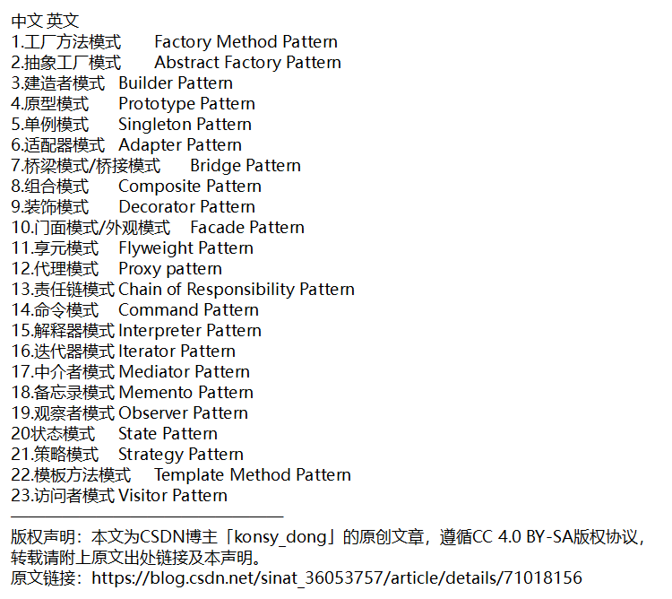
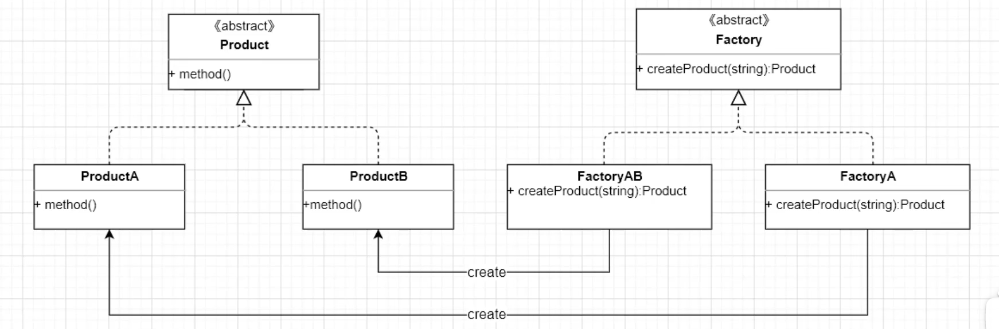
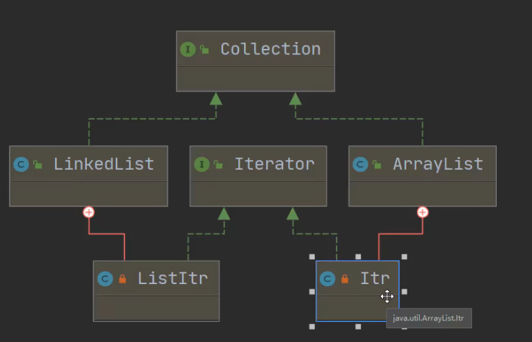

# 设计模式



## 单例模式

> 确保一个类只有一个实例，而且自行实例化并向整个系统提供这个实例

- private 构造方法（）{

  

  }

- 实例是static，属于类的

> 饿汉式

```java
class Singleton {
    private static Singleton singleton = new Singleton();

    private Singleton() {
    }


    public static Singleton getInstance() {
        return singleton;
    }
    
}
```

> 懒汉式

```java
class Singleton {
    private static Singleton singleton;

    private Singleton() {
    }


    public static Singleton getInstance() {
        if (singleton == null) {
            singleton = new Singleton();
        }
        return singleton;
    }

}
```

> 锁

防止多次实例化

```java
//双重检查锁
class Singleton {
    private volatile static Singleton singleton;

    private Singleton() {
    }


    public synchronized static Singleton getInstance() {
        if (singleton == null) {
            synchronized (Singleton.class) {
                if (singleton == null) {
                    singleton = new Singleton();
                }
            }
        }
        return singleton;
    }

}

/*
	要加 volatile 修饰 , Singleton singleton = new  Singleton ();
	1.分配内存
	2.初始化对象
	3.指向刚分配的地址,若发生重排序
	
	假设A线程执行了1和3，还没执行2
	B线程来到判断null，B线程就会直接返回还没初始化的instance了，volatile 可以避免重排序
*/
```

## 工厂模式

###  简单工厂模式

- `简单工厂模式`（simple Factory Pattern）：
  - 称为`静态工厂模式`（Static Factory Method），它属于`类创建型模式`。在简单工厂模式中，可以根据参数的不同返回不同类的实例。简单工厂模式专门定义一个类负责创建其他类的实例，被创建的类通常具有共同的父类

#### 静态工厂

```java
package 工厂模式_FactoryPattern;

public class SimpleFactory {

    public static void main(String[] args) {

        Computer computer = ComputerFactory.create(ComputerFactory.ComputerType.ASUS);

        System.out.println(computer);
    }

}
//电脑产品
class Computer{
}
//Asus电脑
class AsusComputer extends Computer{
}
//Dell电脑
class DellComputer extends Computer{
}
//电脑创建工厂
class ComputerFactory{
    public enum ComputerType{
        ASUS,DELL;
    }
    //创建方法：当有新的电脑产品的增加时，需要在create方法中进行添加
    static Computer create(ComputerType computerType){
        if(computerType.equals(ComputerType.ASUS)){
            return new AsusComputer();
        }
        if(computerType.equals(ComputerType.DELL)){
            return new DellComputer();
        }else{
            return null;
        }
    }
}
```

- 优点：实现对象的创建和使用分离，创建交给专门的工厂类。程序员不用关心专门创建，只用关心专门使用
- 缺点：不够灵活、通用

#### 反射实现

符合开闭原则

```java
//电脑产品
class Computer{
}
//Asus电脑
class AsusComputer extends Computer{
}
//Dell电脑
class DellComputer extends Computer{
}
//电脑创建工厂
class ComputerFactory{
    //注册容器
    private static Map<String,Class<? extends Computer>> computerContext = new ConcurrentHashMap<>();
    //注册电脑类型
    static void registerComputer(String computerType,Class<? extends Computer> cls){
        computerContext.put(computerType,cls);
    }
    //创建方法：当有新的电脑产品的增加时，可以通过registerComputer方法将产品注册进来，不用改变代码
    static Computer create(String computerType){

        Computer needComputer = null;
        try {
            needComputer = computerContext.get(computerType).newInstance();
        } catch (InstantiationException e) {
            e.printStackTrace();
        } catch (IllegalAccessException e) {
            e.printStackTrace();
        }

        if(needComputer != null){
            return needComputer;
        }else{
            return null;
        }
    }
}
```

### 开闭原则

> 开闭原则：
>
> ​	一个软件实体如类、模块和函数应该对扩展开放，对修改关闭

### 工厂方法模式

定义一个用于创建对象的接口，让子类决定实例化哪个类。工厂方法使一个类的实例化延迟到其子类





```java
//...需要创建更多对象时，去实现ComputerFactory接口即可，这样即降低了耦合度，又不违背开闭原则
```

```java
//产品
class Product {
}

//产品A
class ProductA extends Product {
}

//产品B
class ProductB extends Product {

}

//产品工厂
interface ProductFactory {
    public Product createProduct();
}

//Product创建工厂
class ProductAFactory implements ProductFactory {
    @Override
    public Product createProduct() {
        return new ProductA();
    }
}

//Product创建工厂
class ProductBFactory implements ProductFactory {
    @Override
    public Product createProduct() {
        return new ProductB();
    }
}
```

### 抽象工厂模式

抽象工厂模式，可以认为是工厂方法模式的增强版，其提供了多种对象的创建方法，使得工厂方法模式可以在不同维度上进行不同对象的创建。

```java
class Animal {
}

class Dog extends Animal {
}

class Cat extends Animal {
}

class AnimalServer {
}

class DogServer extends AnimalServer {
}

class CatServer extends AnimalServer {
}

interface AnimalFactory {

    public Animal createAnimal();

    public AnimalServer createServer();

}

class DogFactory implements AnimalFactory {

    @Override
    public Animal createAnimal() {
        return new Dog();
    }

    @Override
    public AnimalServer createServer() {
        return new DogServer();
    }
}

class CatFactory implements AnimalFactory {

    @Override
    public Animal createAnimal() {
        return new Cat();
    }

    @Override
    public AnimalServer createServer() {
        return new CatServer();
    }
}
```

